# Architecture

## Overview

MiniGlean is a personal AI knowledge search assistant. Users upload documents, paste URLs, or write notes — then search and chat across all of it using a RAG-powered agent.

The system is deployed across three cloud services on free tiers: Vercel (frontend), Railway (backend), and Supabase (database with vector search).

---

## System Diagram

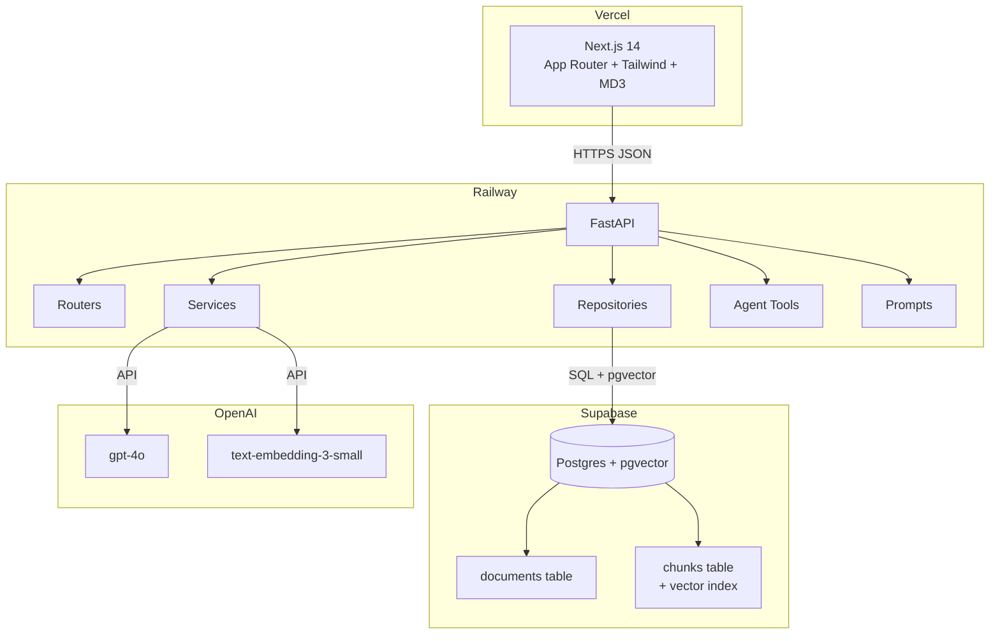

## Layer Architecture

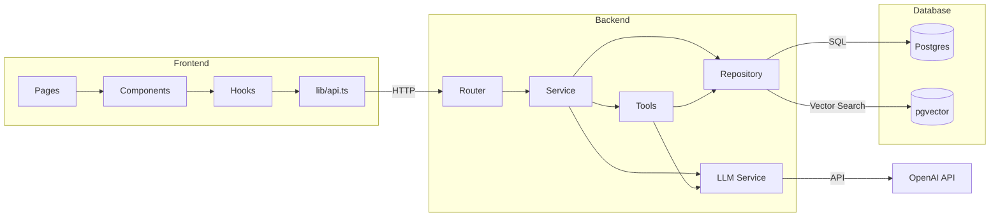

## Backend Layer Responsibilities

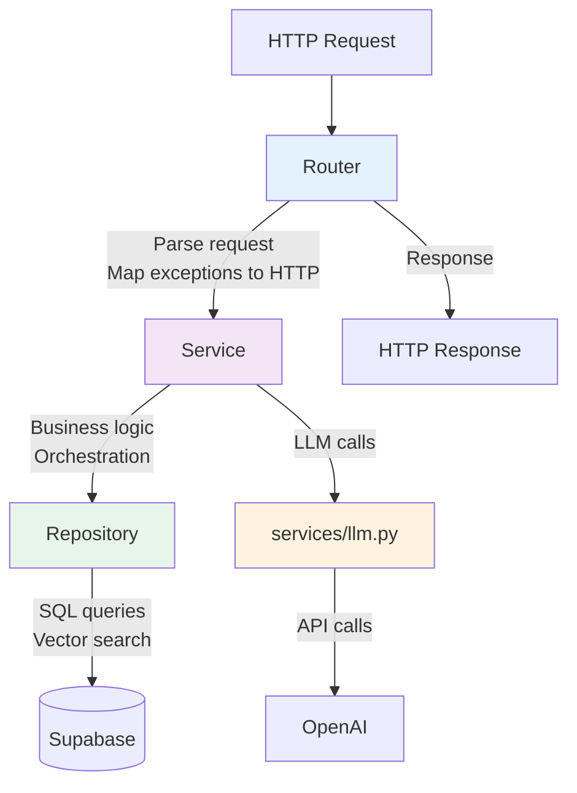

| Layer | Location | Responsibility | Allowed to Call |
|-------|----------|----------------|-----------------|
| Router | `routers/` | HTTP parsing, status codes, CORS | Services only |
| Service | `services/` | Business logic, orchestration | Repositories, LLM service |
| Repository | `repositories/` | SQL queries, vector search, returns data | Database only |
| Tool | `tools/` | Agent capabilities | Repositories, LLM service |
| Prompt | `prompts/` | LLM prompt templates | Nothing — these are constants |

## Data Flow — Document Ingestion

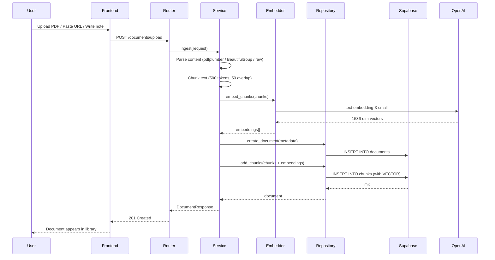

## Data Flow — Chat / RAG Query

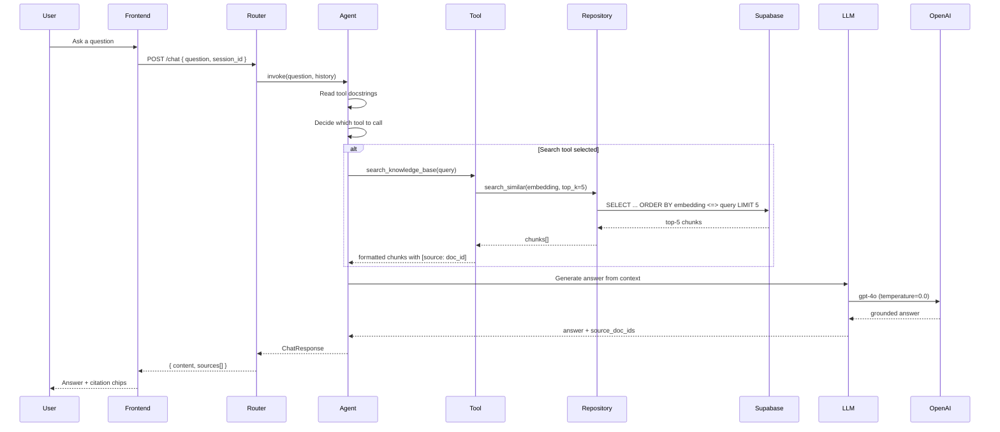

## Data Flow — Agent Tool Selection

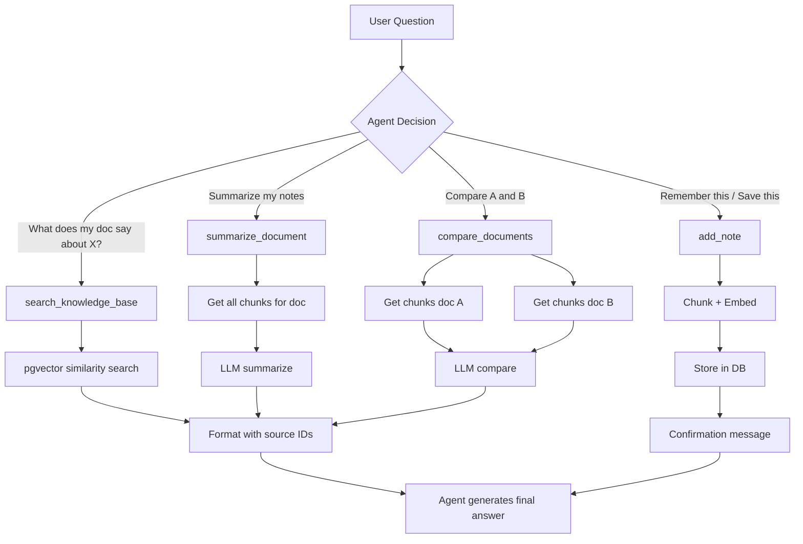

## Database Schema

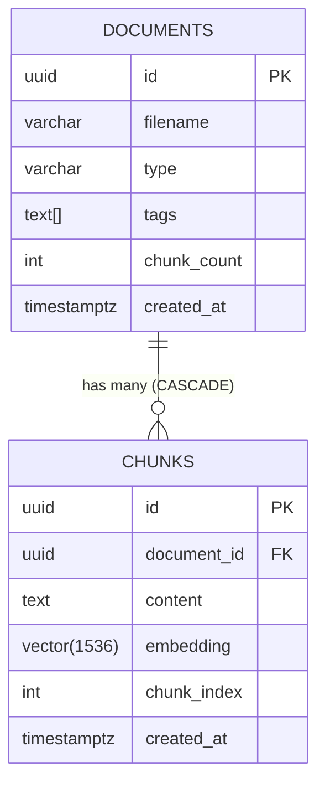

## Vector Search Strategy
- Index type: IVFFlat (approximate nearest neighbour)
- Distance metric: Cosine (<=> operator)
- Index config: lists = 10 (appropriate for < 10,000 chunks)
- Dimensions: 1536 (text-embedding-3-small output)

## Frontend Architecture

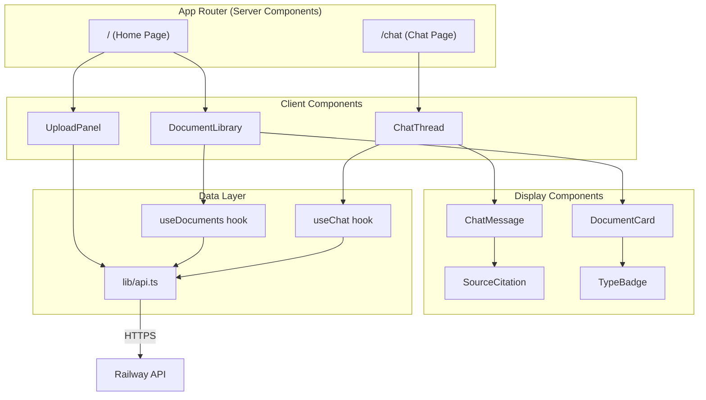

## Agent Architecture

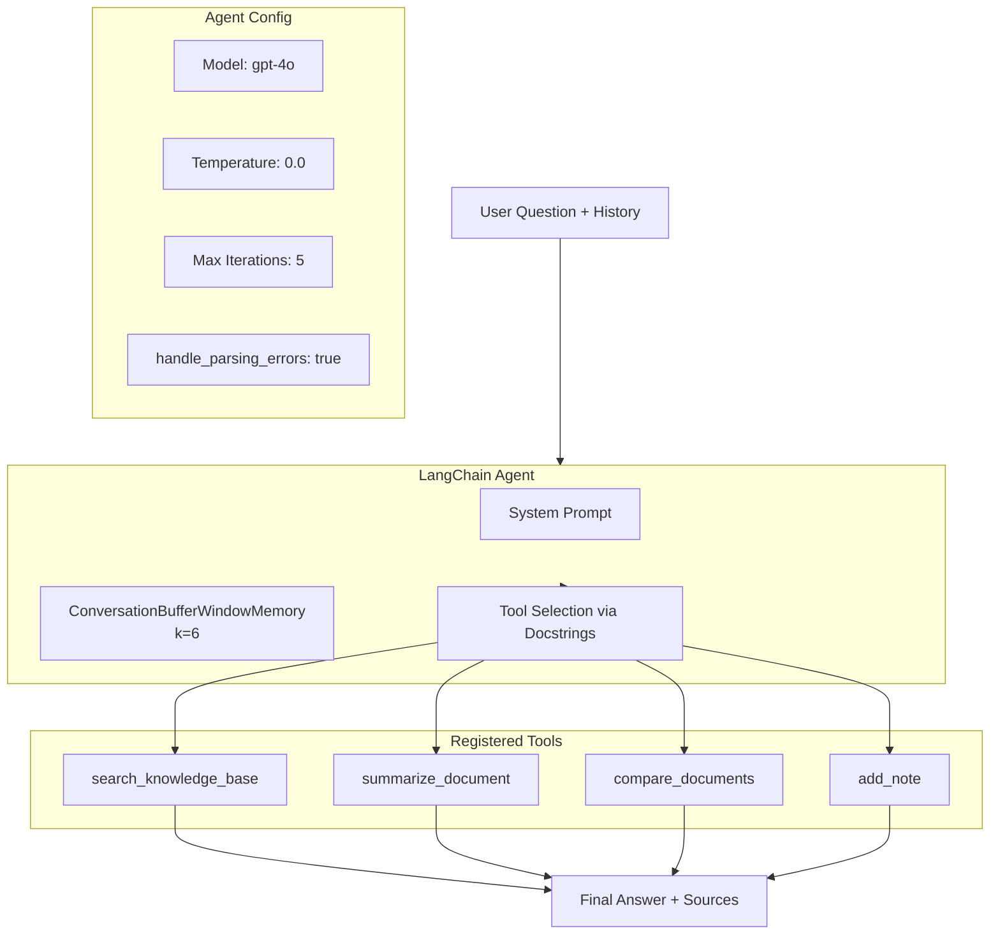

## Deployment Architecture

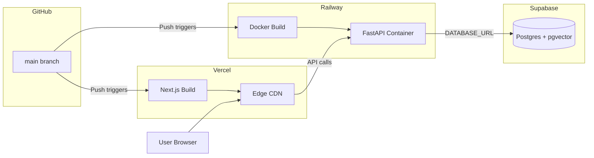

## Request Lifecycle

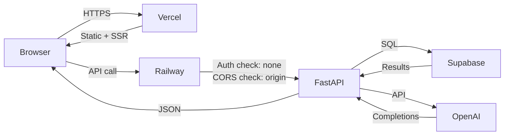

### Technology Decisions

| Decision | Choice | Why |
|----------|--------|-----|
| Frontend framework | Next.js 14 App Router | Server Components by default, fast deploys on Vercel |
| Styling | Tailwind + MD3 tokens | Utility-first, no runtime CSS, consistent design system |
| Backend framework | FastAPI | Async-native, auto docs, Pydantic integration |
| Database | Supabase Postgres | Free tier, managed, pgvector support |
| Vector search | pgvector | Same DB for metadata + vectors, no extra service |
| Embedding model | text-embedding-3-small | Cheap, fast, 1536 dims sufficient for this scale |
| LLM | gpt-4o | Best reasoning for tool selection and grounded Q&A |
| Agent framework | LangChain | Tool orchestration, memory management built-in |
| Deployment | Vercel + Railway | Auto-deploys from GitHub, free tiers |

### Constraints

| Constraint | Value | Reason |
|------------|-------|--------|
| Max documents | 20 | Demo stability, free tier limits |
| Max PDF pages | 20 | Keep ingestion fast and cheap |
| Chunk size | 500 tokens | Balance between context and precision |
| Chunk overlap | 50 tokens | Prevent losing context at boundaries |
| Top K retrieval | 5 | Enough context without overwhelming the LLM |
| Chat memory | 6 messages | Keep context relevant, avoid token bloat |
| Agent max iterations | 5 | Prevent infinite loops |
| LLM temperature | 0.0 | Factual, deterministic answers |
| URL scraping | Static HTML only | BeautifulSoup can't execute JavaScript |
| Auth | None | Single-user portfolio project |

### Security Considerations

*Even though this is a single-user app with no auth:*

| Concern | Mitigation |
|---------|------------|
| API key exposure | Keys in env vars only — never in client code |
| CORS | `ALLOWED_ORIGINS` restricted to Vercel domain |
| SQL injection | Parameterized queries via SQLAlchemy — never string concatenation |
| File upload abuse | 10MB limit, PDF-only content type check |
| Prompt injection | Grounding rules in system prompt; tools are read-only |
| Cost runaway | Max 20 documents; max 5 iterations per agent call |

### Monitoring (Lightweight)

*No dedicated monitoring stack — keep it simple for a portfolio project:*

| What | How |
|------|-----|
| Backend health | `GET /health` — checks DB connection |
| Errors | Railway logs (stdout/stderr) |
| OpenAI spend | OpenAI dashboard usage page |
| DB size | Supabase dashboard → Database → Usage |
| Cold starts | First request after Railway sleep (~10s) — acceptable |