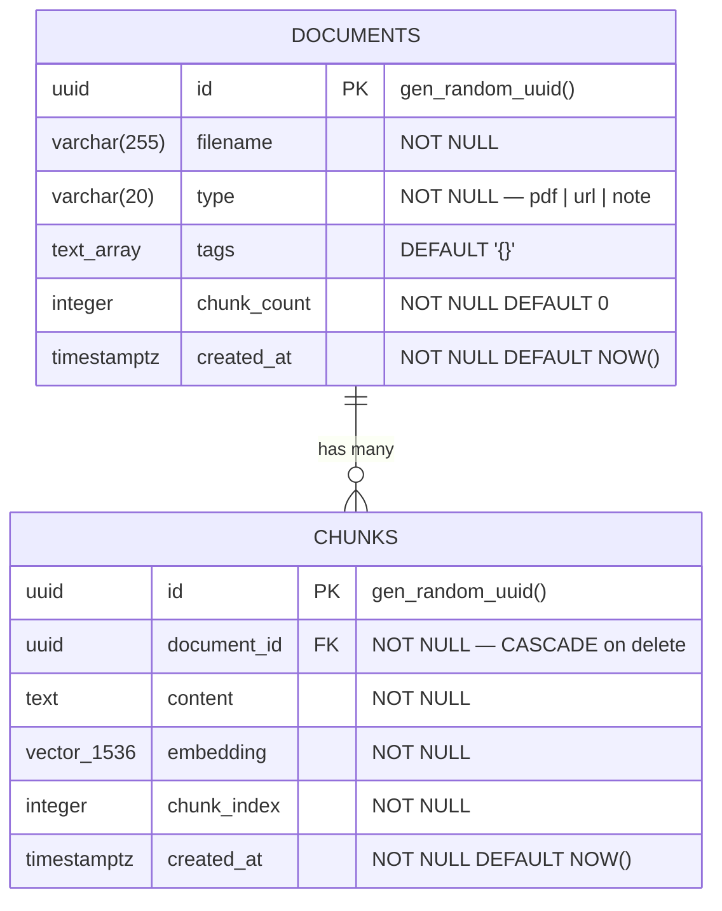
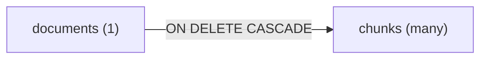
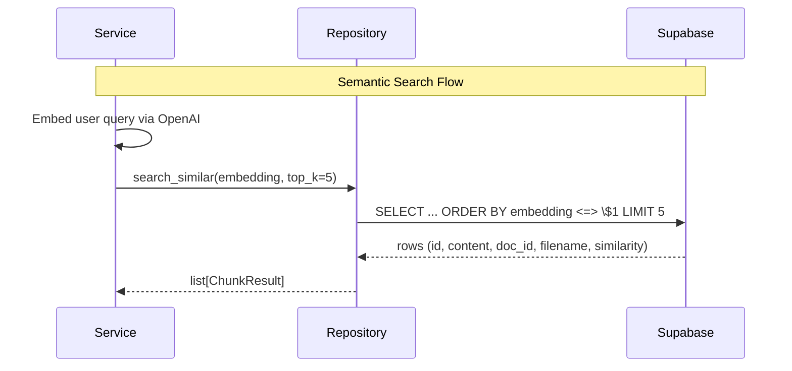
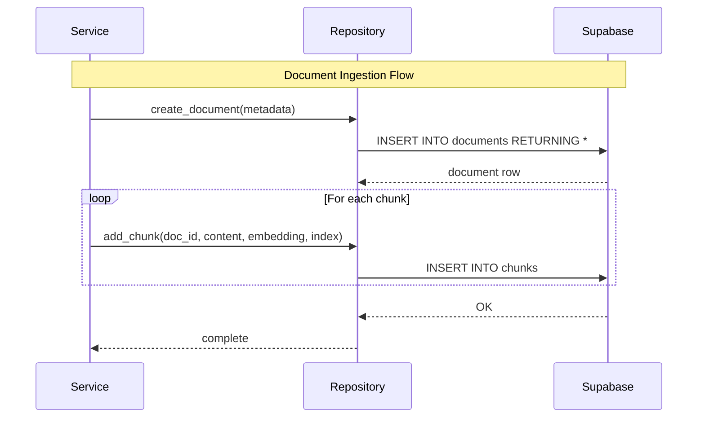

# Database

## Overview

MiniGlean uses a single Supabase Postgres instance with the pgvector extension. Both document metadata and vector embeddings live in the same database — no separate vector store needed.

---

## Schema Diagram



## Table Definitions

### documents
Stores metadata about each ingested document. One row per upload.

```sql
CREATE TABLE documents (
    id          UUID PRIMARY KEY DEFAULT gen_random_uuid(),
    filename    VARCHAR(255) NOT NULL,
    type        VARCHAR(20) NOT NULL CHECK (type IN ('pdf', 'url', 'note')),
    tags        TEXT[] DEFAULT '{}',
    chunk_count INTEGER NOT NULL DEFAULT 0,
    created_at  TIMESTAMPTZ NOT NULL DEFAULT NOW()
);

CREATE INDEX idx_documents_type ON documents(type);
CREATE INDEX idx_documents_created_at ON documents(created_at DESC);
```

### Documents Table Schema

| Column | Type | Description |
|--------|------|-------------|
| `id` | `UUID` | Auto-generated primary key |
| `filename` | `VARCHAR(255)` | Original filename, URL, or "Untitled Note" |
| `type` | `VARCHAR(20)` | One of: `pdf`, `url`, `note` |
| `tags` | `TEXT[]` | User-assigned topic tags |
| `chunk_count` | `INTEGER` | Number of chunks generated from this document |
| `created_at` | `TIMESTAMPTZ` | When the document was ingested |

### chunks
Stores text chunks with their vector embeddings. Many chunks per document.

```sql
CREATE TABLE chunks (
    id           UUID PRIMARY KEY DEFAULT gen_random_uuid(),
    document_id  UUID NOT NULL REFERENCES documents(id) ON DELETE CASCADE,
    content      TEXT NOT NULL,
    embedding    VECTOR(1536) NOT NULL,
    chunk_index  INTEGER NOT NULL,
    created_at   TIMESTAMPTZ NOT NULL DEFAULT NOW()
);

CREATE INDEX idx_chunks_document_id ON chunks(document_id);
CREATE INDEX idx_chunks_embedding ON chunks
    USING ivfflat (embedding vector_cosine_ops)
    WITH (lists = 10);
```

### Chunks Table Schema

| Column | Type | Description |
|--------|------|-------------|
| `id` | `UUID` | Auto-generated primary key |
| `document_id` | `UUID (FK)` | References parent document — CASCADE on delete |
| `content` | `TEXT` | Raw text content of this chunk |
| `embedding` | `VECTOR(1536)` | OpenAI text-embedding-3-small output |
| `chunk_index` | `INTEGER` | Position of this chunk within the document (0-based) |
| `created_at` | `TIMESTAMPTZ` | When this chunk was stored |

## Relationships



- One document has many chunks
- Deleting a document automatically deletes all its chunks
- chunk_index preserves the original reading order within a document

## pgvector Setup
### Enable the extension
Run once per Supabase project (in SQL Editor):

```sql
CREATE EXTENSION IF NOT EXISTS vector;
```

Verify it's active
```sql
SELECT * FROM pg_extension WHERE extname = 'vector';
```

## Vector Index
### Index Type: IVFFlat

IVFFlat (Inverted File with Flat compression) is an approximate nearest neighbour index. It's fast and good enough for collections under 100,000 vectors.

```sql
CREATE INDEX idx_chunks_embedding ON chunks
    USING ivfflat (embedding vector_cosine_ops)
    WITH (lists = 10);
```

### Vector Index Settings

| Setting | Value | Reason |
|---------|-------|--------|
| Index type | `IVFFlat` | Fast approximate search, low memory |
| Distance operator | `vector_cosine_ops` | Cosine similarity — standard for text embeddings |
| Lists | `10` | Appropriate for < 10,000 chunks (rule: lists = sqrt(rows)) |
| Dimensions | `1536` | Fixed by text-embedding-3-small output size |

### When to rebuild
Rebuild the index after bulk ingestion or deletion:

```sql
REINDEX INDEX idx_chunks_embedding;
```

### Upgrading to HNSW (if needed later)
If the collection grows beyond 10,000 chunks, switch to HNSW for better recall:

```sql
DROP INDEX idx_chunks_embedding;

CREATE INDEX idx_chunks_embedding ON chunks
    USING hnsw (embedding vector_cosine_ops)
    WITH (m = 16, ef_construction = 64);
```

### Core Queries
Insert a document

```sql
INSERT INTO documents (filename, type, tags, chunk_count)
VALUES (\$1, \$2, \$3, \$4)
RETURNING id, filename, type, tags, chunk_count, created_at;
```

Insert chunks with embeddings
```sql
INSERT INTO chunks (document_id, content, embedding, chunk_index)
VALUES (\$1, \$2, \$3, \$4);
```

Semantic search (top-k nearest chunks)
```sql
SELECT
    c.id,
    c.content,
    c.document_id,
    c.chunk_index,
    d.filename,
    d.type,
    1 - (c.embedding <=> \$1) AS similarity
FROM chunks c
JOIN documents d ON d.id = c.document_id
ORDER BY c.embedding <=> \$1
LIMIT \$2;
```

$1 = query embedding (1536-dim vector)
$2 = top_k (default 5)
<=> = cosine distance operator (lower = more similar)
1 - distance = similarity score (higher = more similar)

Get all chunks for a document
```sql
SELECT id, content, chunk_index
FROM chunks
WHERE document_id = \$1
ORDER BY chunk_index;
```

List all documents
```sql
SELECT id, filename, type, tags, chunk_count, created_at
FROM documents
ORDER BY created_at DESC;
```

Delete a document (cascades to chunks)
```sql
DELETE FROM documents WHERE id = \$1;
```

Count chunks per document
```sql
SELECT d.id, d.filename, d.chunk_count, COUNT(c.id) AS actual_chunks
FROM documents d
LEFT JOIN chunks c ON c.document_id = d.id
GROUP BY d.id, d.filename, d.chunk_count;
```

### Query Flow Diagram





### SQLAlchemy Models

```python
# apps/api/models.py

from sqlalchemy import Column, String, Integer, DateTime, ARRAY, ForeignKey, CheckConstraint
from sqlalchemy.dialects.postgresql import UUID
from pgvector.sqlalchemy import Vector
from sqlalchemy.orm import relationship, DeclarativeBase
from datetime import datetime, timezone
import uuid


class Base(DeclarativeBase):
    pass


class Document(Base):
    __tablename__ = "documents"

    id = Column(UUID(as_uuid=True), primary_key=True, default=uuid.uuid4)
    filename = Column(String(255), nullable=False)
    type = Column(String(20), nullable=False)
    tags = Column(ARRAY(String), default=[])
    chunk_count = Column(Integer, nullable=False, default=0)
    created_at = Column(DateTime(timezone=True), default=lambda: datetime.now(timezone.utc))

    chunks = relationship("Chunk", back_populates="document", cascade="all, delete-orphan")

    __table_args__ = (
        CheckConstraint("type IN ('pdf', 'url', 'note')", name="valid_document_type"),
    )


class Chunk(Base):
    __tablename__ = "chunks"

    id = Column(UUID(as_uuid=True), primary_key=True, default=uuid.uuid4)
    document_id = Column(
        UUID(as_uuid=True),
        ForeignKey("documents.id", ondelete="CASCADE"),
        nullable=False,
    )
    content = Column(String, nullable=False)
    embedding = Column(Vector(1536), nullable=False)
    chunk_index = Column(Integer, nullable=False)
    created_at = Column(DateTime(timezone=True), default=lambda: datetime.now(timezone.utc))

    document = relationship("Document", back_populates="chunks")
```

### Repository Pattern
Document Repository

```python
# apps/api/repositories/document_repository.py

from sqlalchemy.ext.asyncio import AsyncSession
from sqlalchemy import select
from models import Document


class DocumentRepository:
    def __init__(self, session: AsyncSession):
        self.session = session

    async def create(self, document: Document) -> Document:
        self.session.add(document)
        await self.session.commit()
        await self.session.refresh(document)
        return document

    async def get_by_id(self, doc_id: str) -> Document | None:
        return await self.session.get(Document, doc_id)

    async def list_all(self) -> list[Document]:
        result = await self.session.execute(
            select(Document).order_by(Document.created_at.desc())
        )
        return list(result.scalars().all())

    async def count(self) -> int:
        result = await self.session.execute(select(Document))
        return len(result.scalars().all())

    async def delete(self, doc_id: str) -> bool:
        doc = await self.get_by_id(doc_id)
        if not doc:
            return False
        await self.session.delete(doc)
        await self.session.commit()
        return True
```

### Chunk Repository

```python
# apps/api/repositories/chunk_repository.py

from sqlalchemy.ext.asyncio import AsyncSession
from sqlalchemy import select, text
from models import Chunk


class ChunkRepository:
    def __init__(self, session: AsyncSession):
        self.session = session

    async def add_chunks(self, chunks: list[Chunk]) -> None:
        self.session.add_all(chunks)
        await self.session.commit()

    async def search_similar(self, embedding: list[float], top_k: int = 5) -> list[dict]:
        query = text("""
            SELECT
                c.id,
                c.content,
                c.document_id,
                c.chunk_index,
                d.filename,
                d.type,
                1 - (c.embedding <=> :embedding) AS similarity
            FROM chunks c
            JOIN documents d ON d.id = c.document_id
            ORDER BY c.embedding <=> :embedding
            LIMIT :top_k
        """)
        result = await self.session.execute(
            query, {"embedding": str(embedding), "top_k": top_k}
        )
        return [dict(row._mapping) for row in result]

    async def get_by_document_id(self, doc_id: str) -> list[Chunk]:
        result = await self.session.execute(
            select(Chunk)
            .where(Chunk.document_id == doc_id)
            .order_by(Chunk.chunk_index)
        )
        return list(result.scalars().all())

    async def delete_by_document_id(self, doc_id: str) -> int:
        chunks = await self.get_by_document_id(doc_id)
        count = len(chunks)
        for chunk in chunks:
            await self.session.delete(chunk)
        await self.session.commit()
        return count
```

### Database Session Management

```python
# apps/api/database.py

from sqlalchemy.ext.asyncio import create_async_engine, AsyncSession, async_sessionmaker
from config import settings

engine = create_async_engine(
    settings.database_url.replace("postgresql://", "postgresql+asyncpg://"),
    echo=(settings.environment == "development"),
)

async_session = async_sessionmaker(engine, class_=AsyncSession, expire_on_commit=False)


async def get_session() -> AsyncSession:
    async with async_session() as session:
        yield session
```

### Injecting into routers

```python
# apps/api/routers/documents.py

from fastapi import Depends
from database import get_session
from repositories.document_repository import DocumentRepository

@router.get("/")
async def list_documents(session: AsyncSession = Depends(get_session)):
    repo = DocumentRepository(session)
    return await repo.list_all()
```

### Alembic Setup
Directory structure

```bash
apps/api/
├── alembic/
│   ├── versions/
│   │   └── 001_initial_schema.py
│   ├── env.py
│   └── script.py.mako
└── alembic.ini
```

### alembic.ini

```ini
[alembic]
script_location = alembic
sqlalchemy.url = %(DATABASE_URL)s

[loggers]
keys = root,sqlalchemy,alembic
```

Commands
```bash
# Create a new migration (auto-detect changes from models)
alembic revision --autogenerate -m "description of change"

# Apply all pending migrations
alembic upgrade head

# Rollback one migration
alembic downgrade -1

# Check current applied version
alembic current

# View migration history
alembic history --verbose
```

## Migration rules
- One migration per logical schema change
- Always test locally before applying to Supabase
- Never edit a migration that's been applied to production
- Name migrations descriptively: add_tags_to_documents, create_chunks_table
-  Include the pgvector index creation in the initial migration