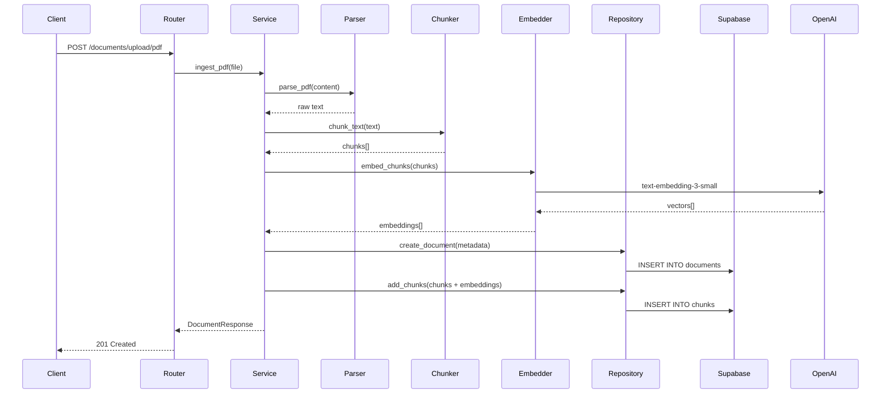

# Milestone 2 — Document Ingestion

## Goal

Users can upload a PDF, paste a URL, or write a note. The content gets parsed, chunked, embedded, and stored in the database. Documents can be listed and deleted.

## Done When

* [ ] `POST /documents/upload/pdf` accepts a PDF file, parses it, chunks it, embeds it, and stores it
* [ ] `POST /documents/url` scrapes a static HTML page, chunks it, embeds it, and stores it
* [ ] `POST /documents/note` accepts plain text, chunks it, embeds it, and stores it
* [ ] `GET /documents` returns all ingested documents ordered by `created_at` descending
* [ ] `DELETE /documents/{id}` removes a document and all its chunks (CASCADE)
* [ ] Each document record includes: id, filename, type, tags, chunk_count, created_at
* [ ] Each chunk is stored with: content, embedding (1536 dims), chunk_index, document_id
* [ ] Maximum document limit (20) is enforced — returns 400 if exceeded
* [ ] PDF upload validates: file type (PDF only), file size (max 10MB), page count (max 20)
* [ ] URL ingestion validates: URL format, static HTML only
* [ ] Chunking uses 500 tokens with 50 token overlap
* [ ] All embeddings use `text-embedding-3-small` (1536 dimensions)
* [ ] Unit tests cover: happy path for each endpoint, validation errors, max document limit
* [ ] `ruff check .` passes

## Out of Scope

* No chat or search functionality (Milestone 3)
* No LangChain agent or tools (Milestone 4)
* No frontend UI for upload (Milestone 5)
* No deployment (Milestone 6)

## Architecture



## New Files

After this milestone, the following files are added or modified:

```
apps/api/
├── routers/
│   ├── health.py                      (existing)
│   └── documents.py                   ← NEW
├── services/
│   ├── document_service.py            ← NEW
│   ├── parser.py                      ← NEW
│   ├── chunker.py                     ← NEW
│   ├── embedder.py                    ← NEW
│   └── exceptions.py                  ← NEW
├── repositories/
│   ├── document_repository.py         (update — implement methods)
│   └── chunk_repository.py            (update — implement methods)
├── schemas.py                         ← NEW
├── main.py                            (update — register documents router)
├── requirements.txt                   (update — add pdfplumber, beautifulsoup4, tiktoken, openai)
└── tests/
    ├── unit/
    │   ├── test_document_service.py   ← NEW
    │   ├── test_parser.py             ← NEW
    │   ├── test_chunker.py            ← NEW
    │   └── test_embedder.py           ← NEW
    └── fixtures/
        └── sample.pdf                 ← NEW (1-page test PDF)
```

## Tasks

### 1. Add dependencies

Update `requirements.txt`:

```
pdfplumber==0.10.4
beautifulsoup4==4.12.3
tiktoken==0.5.2
openai==1.12.0
```

### 2. Define schemas

`apps/api/schemas.py` — request and response models for all document endpoints:

* `DocumentResponse` — id, filename, type, tags, chunk_count, created_at
* `DocumentListResponse` — list of `DocumentResponse`
* `UrlIngestRequest` — url (string, validated)
* `NoteIngestRequest` — content (string), tags (optional list)
* `ErrorResponse` — detail, code

### 3. Define custom exceptions

`apps/api/services/exceptions.py`:

| Exception | When Raised |
|---|---|
| `DocumentNotFoundError` | Document ID doesn't exist |
| `DocumentLimitExceededError` | Already at 20 documents |
| `InvalidFileTypeError` | Upload is not a PDF |
| `FileTooLargeError` | PDF exceeds 10MB |
| `PageLimitExceededError` | PDF has more than 20 pages |
| `ParseError` | pdfplumber or BeautifulSoup fails to extract text |
| `EmbeddingError` | OpenAI embedding call fails |

### 4. Create the parser service

`apps/api/services/parser.py` — three functions, one per document type:

`parse_pdf(content: bytes) → str`

* Uses `pdfplumber` to extract text from PDF bytes
* Validates page count ≤ 20
* Raises `PageLimitExceededError` if exceeded
* Raises `ParseError` if extraction returns empty text
* Returns concatenated text from all pages

`parse_url(url: str) → tuple[str, str]`

* Uses `httpx` to fetch the page (timeout: 10 seconds)
* Uses `BeautifulSoup` to extract text from HTML body
* Strips `nav`, `header`, `footer`, `script`, `style` elements
* Returns `(text, page_title)` — title used as filename
* Raises `ParseError` if page is empty or unreachable

`parse_note(content: str) → str`

* Strips whitespace
* Returns content as-is
* Raises `ParseError` if empty after stripping

### 5. Create the chunker service

`apps/api/services/chunker.py`:

`chunk_text(text: str, chunk_size: int = 500, overlap: int = 50) → list[str]`

* Uses `tiktoken` to count tokens (encoding: `cl100k_base` — same as OpenAI models)
* Splits text into chunks of `chunk_size` tokens
* Each chunk overlaps with the previous by `overlap` tokens
* Preserves sentence boundaries where possible — don't cut mid-sentence
* Returns list of chunk strings
* If text is shorter than `chunk_size`, returns a single chunk

Chunk rules:

* Minimum chunk size: 50 tokens (don't create tiny fragments)
* Merge the last chunk into the previous if it's less than 50 tokens

### 6. Create the embedder service

`apps/api/services/embedder.py`:

`embed_chunks(chunks: list[str]) → list[list[float]]`

* Calls OpenAI `text-embedding-3-small` with batch of texts
* Returns list of 1536-dimension vectors
* Raises `EmbeddingError` if the API call fails
* Uses the `openai` Python SDK
* Batches in groups of 20 (OpenAI recommends ≤ 2048 inputs, but smaller batches are safer)

`embed_query(query: str) → list[float]`

* Single text embedding for search queries
* Same model: `text-embedding-3-small`
* Returns one 1536-dimension vector

### 7. Create the document service

`apps/api/services/document_service.py` — orchestrates the full ingestion pipeline. Three entry points:

`ingest_pdf(file_content: bytes, filename: str) → DocumentResponse`

* Check document count < 20 (via repository) → raise `DocumentLimitExceededError`
* Parse PDF → raw text
* Chunk text → list of chunk strings
* Embed chunks → list of vectors
* Create document record in DB (via `document_repository`)
* Create chunk records with embeddings in DB (via `chunk_repository`)
* Return `DocumentResponse`

`ingest_url(url: str) → DocumentResponse`

* Check document count < 20
* Parse URL → (text, title)
* Chunk → embed → store (same as above)
* filename = page title or URL hostname

`ingest_note(content: str, tags: list[str]) → DocumentResponse`

* Check document count < 20
* Parse note → text
* Chunk → embed → store
* filename = "Untitled Note" or first 50 chars of content

`list_documents() → list[DocumentResponse]`

* Calls `document_repository.list_all()`
* Returns list ordered by `created_at` descending

`delete_document(doc_id: str) → None`

* Calls `document_repository.get_by_id()` → raise `DocumentNotFoundError` if missing
* Calls `document_repository.delete()`
* CASCADE handles chunk cleanup automatically

### 8. Create the documents router

`apps/api/routers/documents.py`:

| Method | Path | Request | Response | Status |
|---|---|---|---|---|
| POST | `/documents/upload/pdf` | `UploadFile` | `DocumentResponse` | 201 |
| POST | `/documents/url` | `UrlIngestRequest` | `DocumentResponse` | 201 |
| POST | `/documents/note` | `NoteIngestRequest` | `DocumentResponse` | 201 |
| GET | `/documents` | — | `list[DocumentResponse]` | 200 |
| DELETE | `/documents/{doc_id}` | — | — | 204 |

Exception mapping:

| Exception | HTTP Status | Message |
|---|---|---|
| `DocumentNotFoundError` | 404 | "Document not found" |
| `DocumentLimitExceededError` | 400 | "Maximum document limit (20) reached" |
| `InvalidFileTypeError` | 415 | "Only PDF files accepted" |
| `FileTooLargeError` | 413 | "File exceeds 10MB limit" |
| `PageLimitExceededError` | 422 | "PDF exceeds 20 page limit" |
| `ParseError` | 422 | "Failed to parse document content" |
| `EmbeddingError` | 502 | "Embedding service unavailable" |

PDF upload validations (in router):

* Content type must be `application/pdf` → 415
* File size must be ≤ 10MB → 413

### 9. Register the router

Update `apps/api/main.py`:

```python
from routers import health, documents

app.include_router(health.router)
app.include_router(documents.router)
```

### 10. Implement repository methods

Update `repositories/document_repository.py` and `repositories/chunk_repository.py` with full implementations using async SQLAlchemy queries.

Key details:

* `chunk_repository.add_chunks()` should batch insert — not one at a time
* `document_repository.count()` uses `SELECT COUNT(*)` — not `SELECT *` then `len()`
* All methods receive an `AsyncSession` via constructor injection

### 11. Write unit tests

`tests/unit/test_chunker.py`:

| Test | Assertion |
|---|---|
| Short text (< 500 tokens) | Returns single chunk |
| Long text (1500 tokens) | Returns 3+ chunks |
| Overlap works | Last N tokens of chunk[i] appear at start of chunk[i+1] |
| Tiny last chunk merged | No chunk smaller than 50 tokens |
| Empty text | Returns empty list or raises |

`tests/unit/test_parser.py`:

| Test | Assertion |
|---|---|
| Valid PDF | Returns extracted text |
| PDF > 20 pages | Raises `PageLimitExceededError` |
| Empty PDF | Raises `ParseError` |
| Valid URL | Returns (text, title) |
| Invalid URL | Raises `ParseError` |
| Empty note | Raises `ParseError` |
| Whitespace-only note | Raises `ParseError` |

`tests/unit/test_embedder.py`:

| Test | Assertion |
|---|---|
| Valid chunks | Returns list of 1536-dim vectors (mock OpenAI) |
| OpenAI failure | Raises `EmbeddingError` |
| Empty list | Returns empty list |

`tests/unit/test_document_service.py`:

| Test | Assertion |
|---|---|
| `ingest_pdf` happy path | Document created, chunks stored, correct `chunk_count` |
| `ingest_url` happy path | Document created with `type='url'` |
| `ingest_note` happy path | Document created with `type='note'` |
| Document limit reached | Raises `DocumentLimitExceededError` |
| Delete existing doc | Returns successfully |
| Delete non-existent doc | Raises `DocumentNotFoundError` |

Mocking strategy:

* Mock OpenAI (embedder) — return fake 1536-dim vectors
* Mock database session (repositories) — return fake documents/chunks
* Mock `httpx` (URL fetching) — return fake HTML
* Never call real external services in unit tests

### 12. Add a test fixture

Create `tests/fixtures/sample.pdf`:

* A simple 1-page PDF with a few paragraphs of text
* Used by parser and service tests
* Keep it small (< 100KB)

## Verification Steps

```bash
# 1. Start services
docker-compose up

# 2. Run migration (if not already applied)
docker-compose exec api alembic upgrade head

# 3. Upload a PDF
curl -X POST http://localhost:8000/documents/upload/pdf \
  -F "file=@tests/fixtures/sample.pdf"
# Should return 201 with document metadata

# 4. Ingest a URL
curl -X POST http://localhost:8000/documents/url \
  -H "Content-Type: application/json" \
  -d '{"url": "https://example.com"}'
# Should return 201

# 5. Add a note
curl -X POST http://localhost:8000/documents/note \
  -H "Content-Type: application/json" \
  -d '{"content": "This is a test note about Python programming.", "tags": ["python"]}'
# Should return 201

# 6. List documents
curl http://localhost:8000/documents
# Should return array of 3 documents

# 7. Verify chunks in database
docker-compose exec db psql -U postgres -d miniglean \
  -c "SELECT d.filename, d.chunk_count, COUNT(c.id) FROM documents d LEFT JOIN chunks c ON c.document_id = d.id GROUP BY d.id;"
# chunk_count should match actual chunks

# 8. Verify embeddings have correct dimensions
docker-compose exec db psql -U postgres -d miniglean \
  -c "SELECT id, vector_dims(embedding) FROM chunks LIMIT 3;"
# All should return 1536

# 9. Delete a document
curl -X DELETE http://localhost:8000/documents/<doc-id>
# Should return 204

# 10. Verify cascade delete
docker-compose exec db psql -U postgres -d miniglean \
  -c "SELECT COUNT(*) FROM chunks WHERE document_id = '<doc-id>';"
# Should return 0

# 11. Test document limit
# Upload 20 documents, then try a 21st
# Should return 400: "Maximum document limit (20) reached"

# 12. Test invalid PDF
curl -X POST http://localhost:8000/documents/upload/pdf \
  -F "file=@README.md"
# Should return 415: "Only PDF files accepted"

# 13. Run unit tests
cd apps/api && pytest tests/unit/ -v
# All should pass

# 14. Lint
cd apps/api && ruff check .
# Zero warnings
```

## Key Parameters

| Parameter | Value | Configured In |
|---|---|---|
| Chunk size | 500 tokens | `config.py` → `CHUNK_SIZE` |
| Chunk overlap | 50 tokens | `config.py` → `CHUNK_OVERLAP` |
| Embedding model | `text-embedding-3-small` | `config.py` → `EMBEDDING_MODEL` |
| Embedding dimensions | 1536 | Fixed by model |
| Token encoding | `cl100k_base` | `services/chunker.py` |
| Max documents | 20 | `config.py` → `MAX_DOCUMENTS` |
| Max PDF size | 10MB | `routers/documents.py` |
| Max PDF pages | 20 | `services/parser.py` |
| URL fetch timeout | 10 seconds | `services/parser.py` |
| Embedding batch size | 20 | `services/embedder.py` |

## Decisions Made in This Milestone

| Decision | Choice | Reason |
|---|---|---|
| pdfplumber over PyPDF2 | pdfplumber | Better text extraction quality, handles tables |
| tiktoken for token counting | Yes | Same tokenizer as OpenAI models — accurate chunk sizing |
| Sentence boundary preservation | Yes | Better retrieval — chunks are semantically coherent |
| Batch embedding (groups of 20) | Yes | Reduces API calls while staying under rate limits |
| File validation in router | Yes | Fail fast — don't parse 100MB files just to reject them |
| Document limit check first | Yes | Fail fast — don't embed 50 chunks then discover limit reached |
| filename from URL title | Yes | More readable in document library than raw URLs |

## What's Next

After this milestone, move to **Milestone 3 — RAG Core** where we'll add:

* Semantic search endpoint (`POST /chat`)
* Vector similarity search via pgvector
* Grounded Q&A with source citations
* System prompt with grounding rules
* The `services/retriever.py` and `services/llm.py` modules
