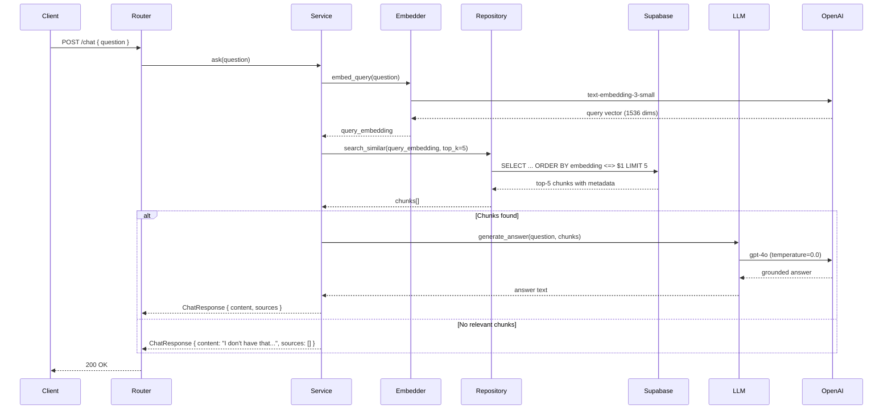

# Milestone 3 — RAG Core

## Goal

A working search and Q&A endpoint that embeds the user's question, retrieves relevant chunks from the database via pgvector, and generates a grounded answer with source citations. No agent or tool selection yet — just direct retrieval + generation.

## Done When

* [ ] `POST /chat` accepts a question and returns an answer with source citations
* [ ] User's question is embedded using `text-embedding-3-small`
* [ ] Top-5 chunks retrieved from pgvector using cosine similarity
* [ ] Answer is generated by `gpt-4o` with temperature 0.0
* [ ] Answer is grounded — only uses information from retrieved chunks
* [ ] If no relevant content is found, response says "I don't have that in my knowledge base"
* [ ] Response shape: `{ content, sources: [{ doc_id, filename, excerpt }] }`
* [ ] Source citations are accurate — each cited doc_id actually contributed to the answer
* [ ] Chat history is not persisted yet (stateless — each request is independent)
* [ ] Prompt templates live in `apps/api/prompts/` — not hardcoded in services
* [ ] LLM calls go through `services/llm.py` — never instantiate OpenAI directly elsewhere
* [ ] Unit tests cover: retrieval returns results, retrieval returns empty, grounded answer, refusal on no context
* [ ] `ruff check .` passes

## Out of Scope

* No LangChain agent or tool selection (Milestone 4)
* No multi-turn memory or session tracking (Milestone 4)
* No summarize, compare, or add_note capabilities (Milestone 4)
* No frontend chat UI (Milestone 5)
* No streaming responses yet (Milestone 5)

## Architecture



## New Files

```
apps/api/
├── routers/
│   └── chat.py                    ← NEW
├── services/
│   ├── chat_service.py            ← NEW
│   ├── retriever.py               ← NEW
│   ├── llm.py                     ← NEW
│   ├── embedder.py                (existing — add embed_query)
│   └── exceptions.py              (update — add LLMError)
├── prompts/
│   └── qa.py                      ← NEW
├── schemas.py                     (update — add chat schemas)
├── main.py                        (update — register chat router)
└── tests/
    └── unit/
        ├── test_chat_service.py   ← NEW
        ├── test_retriever.py      ← NEW
        └── test_llm.py            ← NEW
```

## Tasks

### 1. Create the QA prompt

`apps/api/prompts/qa.py` — the system prompt that grounds the LLM's answers in retrieved context:

```python
QA_SYSTEM_PROMPT = """
You are MiniGlean, a personal knowledge assistant.
You answer questions based ONLY on the provided context.

Rules:
- Use only the information in the context below to answer
- If the answer is not in the context, say exactly: "I don't have that in my knowledge base."
- Never use your general knowledge to fill gaps
- Be concise — answer in 2-4 sentences unless the user asks for detail
- Always reference which source the information came from using the format [source: doc_id]

Context:
{context}
"""
```

Prompt structure rules:

* Role: what the LLM is
* Task: answer from context only
* Constraints: no general knowledge, must refuse if not found
* Format: concise, cite sources
* Placeholder: `{context}` filled at runtime with retrieved chunks

### 2. Create the LLM service

`apps/api/services/llm.py` — single entry point for all OpenAI chat completions. No other file should instantiate the OpenAI client.

`generate_answer(question: str, context: str) → str`

* Builds the prompt using `QA_SYSTEM_PROMPT` from `prompts/qa.py`
* Fills `{context}` placeholder with the formatted chunks
* Sends to `gpt-4o` with `temperature=0.0`
* Returns the assistant's response content as a string
* Raises `LLMError` if the API call fails

`get_client() → OpenAI`

* Creates and caches a single OpenAI client instance
* Uses `OPENAI_API_KEY` from settings

Configuration pulled from `config.py`:

* `LLM_MODEL` (default: `gpt-4o`)
* `LLM_TEMPERATURE` (default: `0.0`)

### 3. Create the retriever service

`apps/api/services/retriever.py` — combines embedding + vector search into a single retrieval step.

`retrieve(question: str, top_k: int = 5) → list[RetrievedChunk]`

* Embed the question using `embedder.embed_query(question)`
* Search using `chunk_repository.search_similar(embedding, top_k)`
* Map results to `RetrievedChunk` objects
* Return list (may be empty)

`RetrievedChunk` dataclass:

```python
@dataclass
class RetrievedChunk:
    chunk_id: str
    content: str
    document_id: str
    filename: str
    similarity: float
```

Filtering:

* Only return chunks with similarity > 0.3 (configurable threshold)
* If all chunks are below threshold, return empty list
* This prevents low-quality context from polluting the answer

### 4. Create the chat service

`apps/api/services/chat_service.py` — orchestrates the full RAG pipeline: retrieve → format → generate → respond.

`ask(question: str) → ChatResponse`

* Call `retriever.retrieve(question, top_k=5)`
* If no chunks returned → return refusal response with empty sources
* Format chunks into context string
* Call `llm.generate_answer(question, context)`
* Extract unique source documents from retrieved chunks
* Build and return `ChatResponse`

Context formatting — each chunk formatted as:

```
[source: {doc_id} | {filename}]
{content}
```

Multiple chunks separated by `\n\n---\n\n`

Source extraction:

* Deduplicate by `document_id`
* Include first 100 characters of the most relevant chunk as excerpt
* Order sources by highest similarity first

### 5. Add chat schemas

Update `apps/api/schemas.py`:

Request:

```python
class ChatRequest(BaseModel):
    question: str = Field(min_length=1, max_length=2000)
```

Response:

```python
class SourceCitation(BaseModel):
    doc_id: str
    filename: str
    excerpt: str

class ChatResponse(BaseModel):
    id: str           # unique response ID
    content: str      # the generated answer
    sources: list[SourceCitation]
    created_at: str   # ISO timestamp
```

### 6. Create the chat router

`apps/api/routers/chat.py`:

| Method | Path | Request | Response | Status |
|---|---|---|---|---|
| POST | `/chat` | `ChatRequest` | `ChatResponse` | 200 |

Exception mapping:

| Exception | HTTP Status | Message |
|---|---|---|
| `EmbeddingError` | 502 | "Embedding service unavailable" |
| `LLMError` | 502 | "LLM service unavailable" |
| Validation error | 422 | "Question must be between 1-2000 characters" |

### 7. Register the router

Update `apps/api/main.py`:

```python
from routers import health, documents, chat

app.include_router(health.router)
app.include_router(documents.router)
app.include_router(chat.router)
```

### 8. Add LLMError exception

Update `apps/api/services/exceptions.py`:

```python
class LLMError(Exception):
    """Raised when the OpenAI chat completion call fails."""
```

### 9. Update the embedder

Update `apps/api/services/embedder.py` — ensure `embed_query(query: str) → list[float]` exists (may already be scaffolded from Milestone 2). This is the single-text embedding used for search queries.

### 10. Write unit tests

`tests/unit/test_retriever.py`:

| Test | Setup | Assertion |
|---|---|---|
| Returns relevant chunks | Mock embedder + mock repository returns 5 chunks | Returns 5 `RetrievedChunk` objects |
| Returns empty when no matches | Mock repository returns empty list | Returns empty list |
| Filters low similarity | Mock repository returns chunks below 0.3 threshold | Returns empty list |
| Respects top_k | Mock repository with `top_k=3` | Returns max 3 chunks |

`tests/unit/test_llm.py`:

| Test | Setup | Assertion |
|---|---|---|
| Generates answer | Mock OpenAI returns content | Returns answer string |
| Uses correct model | Mock OpenAI | Called with `gpt-4o` |
| Uses correct temperature | Mock OpenAI | Called with `temperature=0.0` |
| Raises LLMError on failure | Mock OpenAI raises exception | Raises `LLMError` |

`tests/unit/test_chat_service.py`:

| Test | Setup | Assertion |
|---|---|---|
| Happy path | Mock retriever returns chunks, mock LLM returns answer | Response has content + sources |
| No context found | Mock retriever returns empty | Response content = "I don't have that..." |
| Sources are deduped | Mock retriever returns 3 chunks from 2 docs | Sources list has 2 entries |
| Sources include excerpt | Mock retriever returns chunks | Each source has non-empty excerpt |
| Embedding fails | Mock embedder raises | Raises `EmbeddingError` |
| LLM fails | Mock LLM raises | Raises `LLMError` |

Mocking strategy:

* Mock `embedder.embed_query` — return fake 1536-dim vector
* Mock `chunk_repository.search_similar` — return fake chunk results
* Mock OpenAI client — return fake completion response
* Never call real OpenAI in unit tests

## Verification Steps

```bash
# 1. Ensure at least one document is ingested (from Milestone 2)
curl http://localhost:8000/documents
# Should return at least one document

# 2. Ask a relevant question
curl -X POST http://localhost:8000/chat \
  -H "Content-Type: application/json" \
  -d '{"question": "What is in my uploaded document?"}'
# Should return a grounded answer with sources

# 3. Verify source citations
# Response should include:
# {
#   "content": "...",
#   "sources": [
#     { "doc_id": "...", "filename": "...", "excerpt": "..." }
#   ]
# }

# 4. Ask an unrelated question
curl -X POST http://localhost:8000/chat \
  -H "Content-Type: application/json" \
  -d '{"question": "What is quantum computing?"}'
# Should return: "I don't have that in my knowledge base."
# Sources should be empty: []

# 5. Verify grounding (no hallucination)
# Ask a question that's partially related but not in the doc
# The answer should NOT invent information

# 6. Check that doc_ids in sources match real documents
# Cross-reference with GET /documents

# 7. Test empty question
curl -X POST http://localhost:8000/chat \
  -H "Content-Type: application/json" \
  -d '{"question": ""}'
# Should return 422 validation error

# 8. Run unit tests
cd apps/api && pytest tests/unit/ -v
# All should pass

# 9. Lint
cd apps/api && ruff check .
# Zero warnings
```

## Prompt Engineering Notes

### Why temperature 0.0?

We want deterministic, factual answers grounded in retrieved context. Higher temperatures introduce creativity and hallucination risk — the opposite of what a knowledge search tool needs.

### Why "I don't have that in my knowledge base"?

This exact phrase:

* Is easy to detect programmatically (frontend can style it differently)
* Sets clear user expectations
* Prevents the LLM from guessing or hallucinating
* Is better UX than a generic "No results found"

### Why similarity threshold of 0.3?

Below 0.3 cosine similarity, chunks are generally irrelevant:

* 0.8+ = highly relevant (same topic, same details)
* 0.5–0.8 = somewhat relevant (related topic)
* 0.3–0.5 = weak relevance (tangentially related)
* < 0.3 = noise (unrelated content)

This threshold prevents the LLM from receiving garbage context and hallucinating an answer from it.

### Context window budget

| Component | Approximate Tokens |
|---|---|
| System prompt | ~150 |
| Context (5 chunks × 500 tokens) | ~2,500 |
| User question | ~50 |
| Total input | ~2,700 |
| Answer budget | ~500 |
| Total | ~3,200 |

Well within gpt-4o's 128K context window. No truncation needed at this scale.

## Key Parameters

| Parameter | Value | Location |
|---|---|---|
| Top K results | 5 | `config.py` → `TOP_K_RESULTS` |
| Similarity threshold | 0.3 | `services/retriever.py` |
| LLM model | `gpt-4o` | `config.py` → `LLM_MODEL` |
| LLM temperature | 0.0 | `config.py` → `LLM_TEMPERATURE` |
| Max question length | 2000 chars | `schemas.py` → `ChatRequest` |
| Context format | `[source: doc_id\|filename]\ncontent` | `services/chat_service.py` |
| Refusal message | "I don't have that in my knowledge base." | `prompts/qa.py` |

## Decisions Made in This Milestone

| Decision | Choice | Reason |
|---|---|---|
| Stateless (no memory) | Each request is independent | Keep it simple — memory added in Milestone 4 |
| Direct retrieval (no agent) | Always search → generate | Agent adds complexity — prove RAG works first |
| Similarity threshold 0.3 | Filter out noise | Prevents hallucination from irrelevant chunks |
| Source deduplication | One entry per document | Cleaner UX — don't show same doc 5 times |
| Excerpt from top chunk | First 100 chars of best-matching chunk | Gives user a preview without overwhelming the response |
| Prompt in separate file | `prompts/qa.py` | Easy to iterate on without touching service logic |
| Single LLM service | `services/llm.py` | One place to change model, temperature, or retry logic |

## What's Next

After this milestone, move to **Milestone 4 — Chat Agent** where we'll add:

* LangChain agent with tool selection
* `search_knowledge_base`, `summarize_document`, `compare_documents`, `add_note` tools
* Multi-turn conversation memory (last 6 exchanges)
* Session tracking via `session_id`
* Agent decides whether to search, summarize, compare, or ask for clarification
