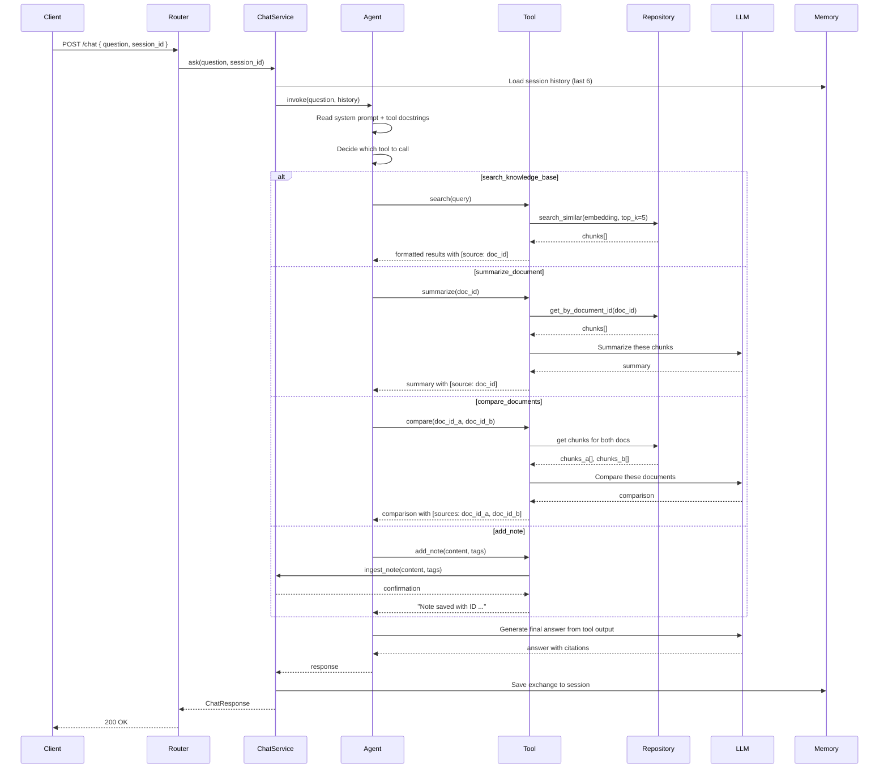

# Milestone 4 — Chat Agent

## Goal

Replace the direct retrieval pipeline from Milestone 3 with a LangChain agent that decides which tool to use based on the user's intent. The agent can search, summarize, compare documents, and save notes. Multi-turn conversation memory is added so the agent understands follow-up questions.

## Done When

* [ ] `POST /chat` now routes through the LangChain agent instead of direct retrieval
* [ ] Agent has 4 registered tools: `search_knowledge_base`, `summarize_document`, `compare_documents`, `add_note`
* [ ] Agent selects the correct tool based on user intent
* [ ] Agent asks clarifying questions when intent is ambiguous
* [ ] Multi-turn memory works — agent remembers last 6 exchanges per session
* [ ] `session_id` in request creates or resumes a conversation session
* [ ] Chat response shape unchanged: `{ content, sources: [{ doc_id, filename, excerpt }] }`
* [ ] Source citations still included for all tool responses that reference documents
* [ ] Agent refuses to answer from general knowledge — grounding rules still enforced
* [ ] Agent stops after max 5 iterations — never loops infinitely
* [ ] Malformed tool calls are handled gracefully (no crashes)
* [ ] Unit tests cover: tool selection, memory, refusal, error handling
* [ ] `ruff check .` passes

## Out of Scope

* No streaming responses (Milestone 5)
* No frontend chat UI (Milestone 5)
* No deployment (Milestone 6)
* No additional tools beyond the 4 defined here

## Architecture



### Memory rules

* Stored in-memory (dict keyed by `session_id`)
* Window size: 6 exchanges (12 messages — 6 user + 6 assistant)
* Oldest messages drop off when window is exceeded
* No persistence across server restarts (acceptable for portfolio)
* Sessions expire after 1 hour of inactivity (simple TTL cleanup)

## New Files

```
apps/api/
├── routers/
│   └── chat.py                        (update — add session_id to request)
├── services/
│   ├── chat_service.py                (update — route through agent)
│   ├── agent.py                       ← NEW
│   ├── memory.py                      ← NEW
│   ├── llm.py                         (update — add summarize/compare methods)
│   └── retriever.py                   (existing — used by search tool)
├── tools/
│   ├── schemas.py                     ← NEW
│   ├── search_knowledge_base.py       ← NEW
│   ├── summarize_document.py          ← NEW
│   ├── compare_documents.py           ← NEW
│   └── add_note.py                    ← NEW
├── prompts/
│   ├── qa.py                          (existing — used as context in agent)
│   ├── system.py                      ← NEW (agent system prompt)
│   ├── summarize.py                   ← NEW
│   └── compare.py                     ← NEW
├── schemas.py                         (update — add session_id)
├── requirements.txt                   (update — add langchain deps)
└── tests/
    └── unit/
        ├── test_agent.py              ← NEW
        ├── test_memory.py             ← NEW
        ├── tools/
        │   ├── test_search.py         ← NEW
        │   ├── test_summarize.py      ← NEW
        │   ├── test_compare.py        ← NEW
        │   └── test_add_note.py       ← NEW
        └── test_chat_service.py       (update)
```

## Tasks

### 1. Add dependencies

Update `requirements.txt`:

```
langchain==0.1.9
langchain-openai==0.0.8
langchain-core==0.1.27
```

### 2. Create the agent system prompt

`apps/api/prompts/system.py`:

```python
AGENT_SYSTEM_PROMPT = """
You are MiniGlean, a personal knowledge assistant.
You help users search, summarize, and compare documents they have uploaded.

Rules:
- Only answer from content retrieved by your tools — never from general knowledge
- Always include the source document ID in your response when referencing a document
- If you cannot find relevant content, say: "I don't have that in my knowledge base."
- If the user's intent is unclear, ask ONE clarifying question before calling a tool
- Never call compare_documents with only one document — ask the user for the second
- You can ONLY use the tools listed below — do not invent tool names

When citing sources, use the format: [source: doc_id]
"""
```

### 3. Create summarize and compare prompts

`apps/api/prompts/summarize.py`:

```python
SUMMARIZE_PROMPT = """
Summarize the following document in clear, plain English.
Be concise — aim for 3 to 5 sentences.
Focus on the key points and main ideas.

Document content:
{content}
"""
```

`apps/api/prompts/compare.py`:

```python
COMPARE_PROMPT = """
Compare these two documents. Return:
1. Key similarities (2-3 points)
2. Key differences (2-3 points)
3. A one-sentence overall verdict

Document A ({doc_id_a}):
{content_a}

Document B ({doc_id_b}):
{content_b}
"""
```

### 4. Create tool input schemas

`apps/api/tools/schemas.py`:

| Schema | Fields |
|---|---|
| `SearchInput` | `query: str`, `top_k: int = 5` |
| `SummarizeInput` | `doc_id: str` |
| `CompareInput` | `doc_id_a: str`, `doc_id_b: str` |
| `AddNoteInput` | `content: str`, `tags: list[str] = []` |

All fields must have `Field(description=...)` — the agent reads these to understand expected inputs.

### 5. Create tools

`apps/api/tools/search_knowledge_base.py`

Docstring:
```
Search the user's personal knowledge base using semantic similarity.
Use this when the user asks a question about something they may have uploaded.
Returns relevant text chunks with their source document IDs.
Do NOT use this for summarizing or comparing — use the dedicated tools for those.
```

Logic:
* Embed the query using `embedder.embed_query()`
* Call `chunk_repository.search_similar(embedding, top_k)`
* Filter by similarity threshold (> 0.3)
* Format each chunk as `[source: {doc_id} | {filename}]\n{content}`
* Return formatted string (or `"No relevant documents found"` if empty)
* Raise `ToolException` on system errors

`apps/api/tools/summarize_document.py`

Docstring:
```
Summarizes a specific document by its ID.
Use this when the user says 'summarize', 'give me a summary', or 'what's in document X'.
Retrieves all chunks from that document and generates a concise summary.
```

Logic:
* Get all chunks for `doc_id` via `chunk_repository.get_by_document_id()`
* If no chunks → return `"No document found with ID '{doc_id}'"`
* Concatenate all chunk contents
* Call `llm.summarize(content)` using the summarize prompt
* Return `[source: {doc_id}]\n{summary}`
* Raise `ToolException` on system errors

`apps/api/tools/compare_documents.py`

Docstring:
```
Compares two documents and highlights their key differences and similarities.
Use this when the user says 'compare X and Y' or 'what's different between A and B'.
Requires two document IDs — ask the user to clarify if only one is provided.
```

Logic:
* Get all chunks for `doc_id_a` and `doc_id_b`
* If either doc is missing → return `"Document '{doc_id}' not found"`
* Concatenate chunks for each document
* Call `llm.compare(content_a, content_b, doc_id_a, doc_id_b)` using compare prompt
* Return `[sources: {doc_id_a}, {doc_id_b}]\n{comparison}`
* Raise `ToolException` on system errors

`apps/api/tools/add_note.py`

Docstring:
```
Saves a plain text note to the knowledge base.
Use this when the user says 'save this', 'remember this', or 'add a note'.
The note is chunked, embedded, and made searchable immediately.
```

Logic:
* Call `document_service.ingest_note(content, tags)`
* Return `"Note saved with ID '{doc_id}' and {chunk_count} chunk(s)."`
* Raise `ToolException` on system errors
* Note: This is the only tool that writes to the database.

### 6. Create the memory service

`apps/api/services/memory.py` — in-memory session store with TTL expiration.

`SessionStore` class:

```python
class SessionStore:
    def __init__(self, max_window: int = 6, ttl_seconds: int = 3600):
        ...

    def get_history(self, session_id: str) -> list[BaseMessage]:
        ...

    def add_exchange(self, session_id: str, user_msg: str, assistant_msg: str) -> None:
        ...

    def clear(self, session_id: str) -> None:
        ...

    def cleanup_expired(self) -> None:
        ...
```

Storage structure:

```python
sessions: dict[str, SessionData]

@dataclass
class SessionData:
    messages: list[BaseMessage]  # LangChain message objects
    last_accessed: datetime
```

Rules:
* `max_window = 6` exchanges → store max 12 messages (6 human + 6 AI)
* When window exceeded → drop oldest exchange (2 messages)
* `ttl_seconds = 3600` → sessions expire after 1 hour of inactivity
* `cleanup_expired()` called periodically (or lazily on access)
* Thread-safe (use `threading.Lock` for dict access)

### 7. Create the agent service

`apps/api/services/agent.py` — builds and invokes the LangChain agent with tools and memory.

`build_agent(tools, system_prompt) → AgentExecutor`

| Setting | Value |
|---|---|
| LLM | `ChatOpenAI(model="gpt-4o", temperature=0.0)` |
| Tools | All 4 registered tools |
| Memory | Injected per-session from `SessionStore` |
| Max iterations | 5 |
| Handle parsing errors | `True` |
| Verbose | `True` in development, `False` in production |

`invoke(question: str, session_id: str) → AgentResponse`

* Get or create session history from `SessionStore`
* Build LangChain memory object from history
* Invoke agent with question + history
* Extract answer and tool outputs
* Save exchange to session store
* Return structured response

`AgentResponse` dataclass:

```python
@dataclass
class AgentResponse:
    content: str
    tool_used: str | None
    source_doc_ids: list[str]
```

### 8. Update the LLM service

Update `apps/api/services/llm.py` — add methods for summarize and compare that tools call:

`summarize(content: str) → str`
* Uses `SUMMARIZE_PROMPT` from `prompts/summarize.py`
* Fills `{content}` placeholder
* Calls `gpt-4o` with temperature 0.0
* Returns summary string

`compare(content_a: str, content_b: str, doc_id_a: str, doc_id_b: str) → str`
* Uses `COMPARE_PROMPT` from `prompts/compare.py`
* Fills placeholders
* Calls `gpt-4o` with temperature 0.0
* Returns comparison string

### 9. Update the chat service

Update `apps/api/services/chat_service.py` — replace direct retrieval with agent invocation.

`ask(question: str, session_id: str) → ChatResponse`

Before (Milestone 3):
```
embed → search → format → generate → respond
```

After (Milestone 4):
```
agent.invoke(question, session_id) → parse sources → respond
```

* Call `agent.invoke(question, session_id)`
* Parse `[source: doc_id]` patterns from agent response content
* Look up filenames for cited `doc_ids`
* Build source citations with excerpts
* Return `ChatResponse`

Source extraction logic:
* Regex: `\[source:\s*([a-f0-9-]+)\]` or `\[sources:\s*([a-f0-9-,\s]+)\]`
* Deduplicate `doc_ids`
* Fetch filename from document repository for each
* Build `SourceCitation` objects

### 10. Update the chat schema

Update `apps/api/schemas.py`:

```python
class ChatRequest(BaseModel):
    question: str = Field(min_length=1, max_length=2000)
    session_id: str = Field(default_factory=lambda: str(uuid4()))
```

* `session_id` is optional — if not provided, a new one is generated
* If provided, resumes existing conversation session

Response shape — add `session_id` field:

```python
class ChatResponse(BaseModel):
    id: str
    content: str
    sources: list[SourceCitation]
    created_at: str
    session_id: str    # ← NEW: return so client can reuse
```

### 11. Update the chat router

Update `apps/api/routers/chat.py`:

* Pass `session_id` from request to `chat_service.ask()`
* Return `session_id` in response
* Add error handling for `ToolException` (500 — "Tool execution failed")

### 12. Write unit tests

`tests/unit/test_memory.py`:

| Test | Assertion |
|---|---|
| New session returns empty history | `get_history("new-id")` → empty list |
| Add exchange stores messages | After add, `get_history()` returns 2 messages |
| Window limit enforced | After 7 exchanges, only last 6 remain (12 messages) |
| Different sessions are isolated | Session A doesn't see Session B's messages |
| Expired session cleaned up | After TTL, session is gone |
| Thread safety | Concurrent reads/writes don't crash |

`tests/unit/test_agent.py`:

| Test | Assertion |
|---|---|
| Agent builds without error | `build_agent()` returns `AgentExecutor` |
| Agent has 4 tools registered | `len(executor.tools) == 4` |
| Max iterations set to 5 | Config check |
| Handle parsing errors enabled | Config check |

`tests/unit/tools/test_search.py`:

| Test | Assertion |
|---|---|
| Returns formatted chunks | Mock repository returns chunks → formatted string with `[source:]` |
| Returns "not found" message | Mock repository returns empty → `"No relevant documents found"` |
| Raises `ToolException` on error | Mock repository raises → `ToolException` |
| Filters by similarity threshold | Chunks below 0.3 not included |

`tests/unit/tools/test_summarize.py`:

| Test | Assertion |
|---|---|
| Returns summary with source | Mock chunks + mock LLM → string contains `[source: doc_id]` |
| Returns "not found" for missing doc | Mock empty chunks → "No document found" message |
| Calls LLM with all chunk content | Mock LLM → assert called with concatenated text |

`tests/unit/tools/test_compare.py`:

| Test | Assertion |
|---|---|
| Returns comparison with both sources | Mock chunks for A and B → contains both doc_ids |
| Returns "not found" if doc A missing | Mock empty for A → "Document not found" message |
| Returns "not found" if doc B missing | Mock empty for B → "Document not found" message |

`tests/unit/tools/test_add_note.py`:

| Test | Assertion |
|---|---|
| Returns confirmation | Mock service → `"Note saved with ID ..."` |
| Raises `ToolException` on failure | Mock service raises → `ToolException` |

`tests/unit/test_chat_service.py` (update):

| Test | Assertion |
|---|---|
| Routes through agent | Mock `agent.invoke` called (not direct retrieval) |
| Parses source doc_ids from response | Content with `[source: abc]` → sources list has `abc` |
| Returns `session_id` in response | Response includes `session_id` |
| New `session_id` generated if not provided | Default factory creates UUID |
| Handles agent error gracefully | Mock agent raises → 502 response |

## Verification Steps

```bash
# 1. Ensure documents exist (from Milestone 2)
curl http://localhost:8000/documents
# Should have at least 2 documents for compare testing

# 2. Search — agent should pick search_knowledge_base
curl -X POST http://localhost:8000/chat \
  -H "Content-Type: application/json" \
  -d '{"question": "What does my document say about X?"}'
# Should return grounded answer with sources

# 3. Summarize — agent should pick summarize_document
curl -X POST http://localhost:8000/chat \
  -H "Content-Type: application/json" \
  -d '{"question": "Summarize my uploaded PDF"}'
# Should return concise summary with source citation

# 4. Compare — agent should pick compare_documents
curl -X POST http://localhost:8000/chat \
  -H "Content-Type: application/json" \
  -d '{"question": "Compare my two documents"}'
# Should return similarities/differences with both sources

# 5. Add note — agent should pick add_note
curl -X POST http://localhost:8000/chat \
  -H "Content-Type: application/json" \
  -d '{"question": "Remember that the meeting is on Friday at 3pm"}'
# Should confirm note saved

# 6. Verify the note was stored
curl http://localhost:8000/documents
# Should show a new document of type "note"

# 7. Multi-turn memory — use same session_id
SESSION="test-session-123"

curl -X POST http://localhost:8000/chat \
  -H "Content-Type: application/json" \
  -d "{\"question\": \"What is in my PDF?\", \"session_id\": \"$SESSION\"}"
# Returns answer

curl -X POST http://localhost:8000/chat \
  -H "Content-Type: application/json" \
  -d "{\"question\": \"Tell me more about that\", \"session_id\": \"$SESSION\"}"
# Should build on previous answer — not ask "about what?"

# 8. Ambiguous intent — agent should ask for clarification
curl -X POST http://localhost:8000/chat \
  -H "Content-Type: application/json" \
  -d '{"question": "Do the thing"}'
# Should ask a clarifying question, not crash

# 9. Grounding — no general knowledge
curl -X POST http://localhost:8000/chat \
  -H "Content-Type: application/json" \
  -d '{"question": "What is the capital of France?"}'
# Should refuse: "I don't have that in my knowledge base."

# 10. Compare with one doc — should ask for second
curl -X POST http://localhost:8000/chat \
  -H "Content-Type: application/json" \
  -d '{"question": "Compare document A"}'
# Should ask: "Which document would you like to compare it with?"

# 11. Run unit tests
cd apps/api && pytest tests/unit/ -v
# All should pass

# 12. Lint
cd apps/api && ruff check .
# Zero warnings
```

## Agent Behaviour Matrix

| User Says | Expected Tool | Expected Behaviour |
|---|---|---|
| "What does my doc say about X?" | `search_knowledge_base` | Search → cited answer |
| "Find information about Y" | `search_knowledge_base` | Search → cited answer |
| "Summarize my PDF" | `summarize_document` | Get chunks → LLM summarize → cited summary |
| "Give me a summary of document Z" | `summarize_document` | Same |
| "Compare A and B" | `compare_documents` | Get both → LLM compare → cited comparison |
| "What's different between my docs?" | `compare_documents` | Same |
| "Remember this: meeting at 3pm" | `add_note` | Ingest → confirm |
| "Save this for later" | `add_note` | Ingest → confirm |
| "Tell me more about that" | (reads memory) → `search_knowledge_base` | Follow-up with context |
| "What is the meaning of life?" | None | Refuse — not in knowledge base |
| "Compare document A" (only one) | None → clarify | Ask for second document |
| "Do something" (vague) | None → clarify | Ask what they want to do |

## Key Parameters

| Parameter | Value | Location |
|---|---|---|
| Agent LLM | `gpt-4o` | `services/agent.py` |
| Agent temperature | 0.0 | `services/agent.py` |
| Max iterations | 5 | `services/agent.py` |
| Handle parsing errors | `True` | `services/agent.py` |
| Memory window | 6 exchanges | `services/memory.py` |
| Session TTL | 3600 seconds (1 hour) | `services/memory.py` |
| Similarity threshold | 0.3 | `tools/search_knowledge_base.py` |
| Top K | 5 | `tools/search_knowledge_base.py` |

## Decisions Made in This Milestone

| Decision | Choice | Reason |
|---|---|---|
| In-memory sessions (not DB) | Dict with TTL | Simple, no schema change, acceptable for single-user portfolio |
| Window size of 6 | Balances context relevance vs token cost | Older messages usually irrelevant |
| LangChain agent over custom routing | Built-in tool selection, memory integration, error handling | Less code to maintain |
| `create_openai_tools_agent` | Over ReAct or custom agent | Native tool calling — more reliable than ReAct parsing |
| Source parsing via regex | Over structured output | Simpler, works well enough for `[source: uuid]` pattern |
| No persistence across restarts | Acceptable for portfolio | Adding Redis would over-complicate the stack |
| `add_note` as a write tool | Only exception to read-only rule | Users expect "remember this" to work |
| 5 max iterations | Prevents runaway costs | If it takes more than 5 loops, something is wrong |

## Error Handling

| Error | Source | Handling |
|---|---|---|
| Agent picks wrong tool | Bad docstring | Fix the docstring — not a code error |
| Agent loops (hits max iterations) | Ambiguous tool output | Agent returns best-effort answer after 5 iterations |
| Agent hallucinates a tool | Weak system prompt | System prompt says "ONLY use listed tools" |
| Tool raises `ToolException` | System failure (DB, OpenAI) | Agent receives error message, may retry or report |
| Malformed tool arguments | Agent passes bad types | `handle_parsing_errors=True` catches this |
| Session not found | New or expired `session_id` | Creates fresh session — no error |
| OpenAI rate limit | Too many requests | Retry with backoff in `services/llm.py` |

## What's Next

After this milestone, move to **Milestone 5 — UI Polish** where we'll add:

* Chat interface with message thread and input
* Document library with upload panel (drag & drop PDF, URL input, note textarea)
* Source citation chips in chat messages
* Streaming responses (SSE) for real-time answer rendering
* Loading states, empty states, error states
* MD3 design system applied to all components
