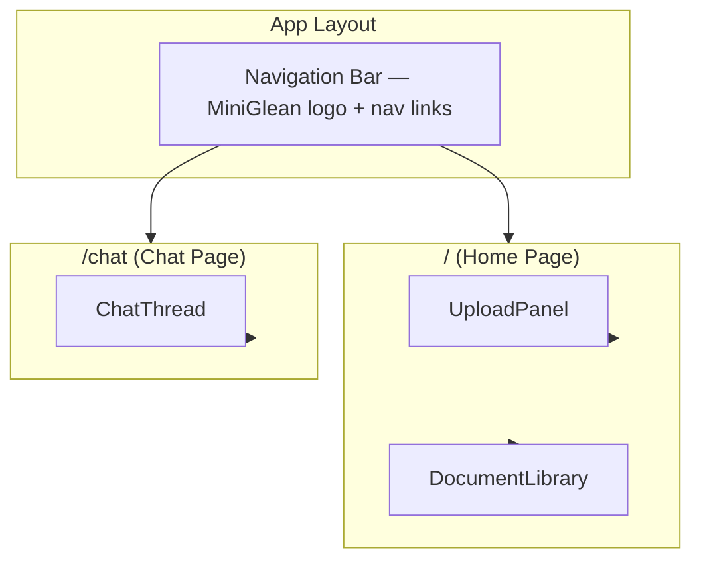

# Milestone 5 — UI Polish

## Goal

A clean, demo-ready frontend with three core views: document library with upload panel, chat interface with streaming responses, and source citations rendered as interactive chips. Material Design 3 applied throughout.

## Done When

* [ ] Home page shows document library and upload panel side by side
* [ ] Upload panel supports: drag & drop PDF, URL input, plain text note
* [ ] Document library displays all documents as cards with filename, type badge, date, chunk count
* [ ] Delete button removes a document with confirmation
* [ ] Chat page has a message thread with user and assistant messages
* [ ] Chat input sends messages and displays streaming responses in real-time
* [ ] Source citations render as expandable chips below assistant messages
* [ ] Multi-turn works — `session_id` persists across messages in the same conversation
* [ ] Loading states shown: skeleton cards, typing indicator, upload progress
* [ ] Empty states shown: no documents yet, no messages yet
* [ ] Error states shown: upload failed, chat failed, network error
* [ ] Mobile responsive — works on phone and tablet
* [ ] MD3 design system applied: colors, typography, shape, elevation, state layers
* [ ] All data fetching in `lib/api.ts` — no fetch inside components
* [ ] All state in hooks — components are presentational
* [ ] No `any` types — strict TypeScript throughout
* [ ] `npm run lint` passes

## Out of Scope

* No authentication or multi-user
* No dark mode toggle (light mode only for demo)
* No keyboard shortcuts
* No drag reordering of documents
* No file previews (PDF viewer, etc.)
* No deployment (Milestone 6)

## Page Structure



## New Files

```
apps/web/
├── app/
│   ├── layout.tsx                    ← UPDATE (add nav, font, theme)
│   ├── page.tsx                      ← UPDATE (home page with library + upload)
│   └── chat/
│       └── page.tsx                  ← NEW
├── components/
│   ├── Nav.tsx                       ← NEW
│   ├── UploadPanel.tsx               ← NEW
│   ├── DocumentLibrary.tsx           ← NEW
│   ├── DocumentCard.tsx              ← NEW
│   ├── TypeBadge.tsx                 ← NEW
│   ├── ChatThread.tsx                ← NEW
│   ├── ChatMessage.tsx               ← NEW
│   ├── SourceCitation.tsx            ← NEW
│   ├── TypingIndicator.tsx           ← NEW
│   ├── EmptyState.tsx                ← NEW
│   └── ErrorBanner.tsx               ← NEW
├── hooks/
│   ├── useDocuments.ts               ← NEW
│   ├── useChat.ts                    ← NEW
│   └── useUpload.ts                  ← NEW
├── lib/
│   ├── api.ts                        ← UPDATE (add all endpoints + SSE)
│   └── theme.ts                      ← UPDATE (full MD3 tokens)
├── tailwind.config.ts                ← UPDATE (MD3 colors, typography)
└── types/
    └── index.ts                      ← NEW (re-export shared types)
```

## Tasks

### 1. Set up MD3 theme tokens

`apps/web/tailwind.config.ts` — extend Tailwind with MD3 semantic color tokens:

```
colors:
  primary, on-primary, primary-container, on-primary-container
  secondary, on-secondary, secondary-container, on-secondary-container
  surface, on-surface, surface-variant, on-surface-variant
  error, on-error
  outline, outline-variant
```

`apps/web/lib/theme.ts` — export typography scale and reusable class combinations:

| Role | Specs |
|---|---|
| Display Large | 57px / 64px / normal / -0.25px tracking |
| Headline Large | 32px / 40px / normal |
| Title Large | 22px / 28px / normal |
| Title Medium | 16px / 24px / medium / 0.15px tracking |
| Body Large | 16px / 24px / normal / 0.5px tracking |
| Body Medium | 14px / 20px / normal / 0.25px tracking |
| Label Large | 14px / 20px / medium / 0.1px tracking |
| Label Medium | 12px / 16px / medium / 0.5px tracking |
| Label Small | 11px / 16px / medium / 0.5px tracking |

### 2. Create the layout and navigation

`apps/web/app/layout.tsx`:

* Set font: Inter (closest to MD3 Roboto Flex)
* Apply `bg-surface text-on-surface` to body
* Render `<Nav />` at the top
* Render `{children}` below

`apps/web/components/Nav.tsx`:

* MiniGlean logo/title on the left
* Two nav links: "Documents" (`/`) and "Chat" (`/chat`)
* Active link highlighted with primary color
* Clean, minimal — no hamburger menu (only 2 links)
* `bg-surface` with `border-b border-outline-variant`

### 3. Build the API client

`apps/web/lib/api.ts` — all backend communication lives here. No fetch calls anywhere else.

| Operation | Type | Purpose |
|---|---|---|
| `listDocuments` | Query | Get all documents |
| `uploadPdf` | Mutation | Upload PDF file |
| `ingestUrl` | Mutation | Ingest a URL |
| `addNote` | Mutation | Save a text note |
| `deleteDocument` | Mutation | Remove a document |
| `chat` | Mutation | Send message, get response |
| `chatStream` | SSE | Stream response tokens |

SSE streaming for chat:

```typescript
async function* streamChat(question: string, sessionId: string): AsyncGenerator<string> {
  const response = await fetch(`${API_URL}/chat/stream`, {
    method: 'POST',
    headers: { 'Content-Type': 'application/json' },
    body: JSON.stringify({ question, session_id: sessionId }),
  });

  const reader = response.body.getReader();
  const decoder = new TextDecoder();

  while (true) {
    const { done, value } = await reader.read();
    if (done) break;
    const chunk = decoder.decode(value);
    // Parse SSE: "data: token\n\n"
    const lines = chunk.split('\n');
    for (const line of lines) {
      if (line.startsWith('data: ') && line !== 'data: [DONE]') {
        yield line.slice(6);
      }
    }
  }
}
```

### 4. Build hooks

`apps/web/hooks/useDocuments.ts`

* State: `documents`, `loading`, `error`
* Actions: `refetch`, `deleteDocument`
* Fetches documents on mount
* `deleteDocument(id)` removes from list optimistically
* Exposes `refetch()` for upload panel to call after success

`apps/web/hooks/useUpload.ts`

* State: `uploading`, `error`, `progress`
* Actions: `uploadPdf`, `ingestUrl`, `addNote`
* Each action sets `uploading = true`, calls API, handles errors
* On success, calls `onSuccess` callback (provided by parent — triggers refetch)
* Validates before sending: file type, file size, URL format, note not empty

`apps/web/hooks/useChat.ts`

* State: `messages`, `loading`, `error`, `sessionId`
* Actions: `sendMessage`
* Generates `sessionId` on first mount (persists for the session)
* `sendMessage(question)`:
  * Append user message to `messages` immediately
  * Set `loading = true`
  * Start streaming response
  * Append assistant message token by token (real-time UI update)
  * When stream completes, parse source citations from final response
  * Set `loading = false`

### 5. Build the Document Library page

`apps/web/app/page.tsx` (Home) — layout:

```
┌──────────────────────────────────────────┐
│  Nav                                      │
├──────────────────────────────────────────┤
│  ┌─────────────┐  ┌──────────────────┐  │
│  │ Upload      │  │  Document        │  │
│  │ Panel       │  │  Library         │  │
│  │             │  │  (grid of cards) │  │
│  └─────────────┘  └──────────────────┘  │
└──────────────────────────────────────────┘
```

* On mobile: stack vertically (upload on top, library below)
* On desktop: side by side (upload 1/3 width, library 2/3 width)

`apps/web/components/UploadPanel.tsx`

Tabs: PDF | URL | Note

PDF tab:
* Drag & drop zone with dashed border
* Click to browse
* Shows filename after selection
* Upload button
* Validates: PDF only, max 10MB
* Error message below if validation fails

URL tab:
* Text input with URL placeholder
* Submit button
* Validates: must be a valid URL

Note tab:
* Textarea (5 rows)
* Save button
* Validates: must not be empty

States:
* Idle: ready to accept input
* Uploading: button disabled, shows spinner
* Success: brief success message, input clears
* Error: red error message below the input

MD3 styling:
* Outlined card (`border border-outline-variant rounded-xl`)
* Tab pills with `secondary-container` for active
* Filled button for submit
* Drag zone: `border-2 border-dashed` → `border-primary bg-primary/8` on drag over

`apps/web/components/DocumentLibrary.tsx`

* Grid: 1 column on mobile, 2 on tablet, 3 on desktop
* Loading: 6 skeleton cards with `animate-pulse`
* Empty: centered message + icon — "No documents yet. Upload a PDF, paste a URL, or write a note."
* Error: red banner with error message and retry button
* Loaded: grid of `DocumentCard` components

`apps/web/components/DocumentCard.tsx`

Layout:
```
┌────────────────────────────┐
│  Filename          TypeBadge│
│  3 chunks · Jan 15, 2026   │
│  [tag1] [tag2]             │
│                    [Delete] │
└────────────────────────────┘
```

MD3 styling:
* Elevated card: `bg-surface shadow-sm rounded-xl`
* Hover: `hover:shadow-md transition-shadow`
* Delete button: text button with `text-error`
* Props: `document`, `onDelete`

`apps/web/components/TypeBadge.tsx`

| Type | Color | Label |
|---|---|---|
| `pdf` | `primary-container` | PDF |
| `url` | `secondary-container` | URL |
| `note` | `surface-variant` | Note |

MD3 styling: Assist chip — `rounded-md px-2 py-0.5 text-[11px] font-medium`

### 6. Build the Chat page

`apps/web/app/chat/page.tsx` — layout:

```
┌──────────────────────────────────────────┐
│  Nav                                      │
├──────────────────────────────────────────┤
│                                           │
│  [Messages scroll area]                   │
│                                           │
│  AI message                               │
│    [source chip] [source chip]           │
│                                           │
│  User message                             │
│                                           │
│  AI message (streaming...)                │
│    ● ● ● (typing indicator)              │
│                                           │
├──────────────────────────────────────────┤
│  [Input field                    ] [Send] │
└──────────────────────────────────────────┘
```

* Messages area fills available height and scrolls
* Input fixed to bottom
* Auto-scroll to bottom on new messages

`apps/web/components/ChatThread.tsx`

Responsibilities:
* Renders message list from `useChat` hook
* Shows `TypingIndicator` when `loading` is true
* Shows `EmptyState` when no messages
* Shows `ErrorBanner` on error
* Handles form submit → calls `sendMessage`
* Auto-scrolls to bottom using `useRef` + `useEffect`

Input:
* Rounded full input field
* Send button (filled, rounded full)
* Disabled during loading
* Enter key submits

`apps/web/components/ChatMessage.tsx`

User message:
* Right-aligned
* `bg-primary text-on-primary rounded-xl rounded-br-sm`
* No source citations

Assistant message:
* Left-aligned
* `bg-surface shadow-sm text-on-surface rounded-xl rounded-bl-sm`
* Source citations rendered below (if any)
* Content updates token by token while streaming

Props: `message: ChatMessage`

`apps/web/components/SourceCitation.tsx`

* Default state: compact chip showing 📄 + truncated filename
* Expanded state: shows excerpt below the chip on click

MD3 styling:
* Assist chip: `border border-outline-variant rounded-md px-3 py-1`
* Hover: `hover:bg-surface-variant`
* Expanded excerpt: `bg-surface-variant rounded-md px-3 py-2 text-xs`

Props: `citation: SourceCitation`

`apps/web/components/TypingIndicator.tsx`

Three bouncing dots in an assistant-style bubble:
* Left-aligned like assistant messages
* `bg-surface shadow-sm rounded-xl rounded-bl-sm`
* Three `span` dots with staggered `animate-bounce` delays

### 7. Build shared UI components

`apps/web/components/EmptyState.tsx`

* Props: `title: string`, `description: string`, `icon?: ReactNode`
* Centered vertically and horizontally
* Title in Title Large typography
* Description in Body Medium with `text-on-surface-variant`
* Used by: `DocumentLibrary` (no docs), `ChatThread` (no messages)

`apps/web/components/ErrorBanner.tsx`

* Props: `message: string`, `onRetry?: () => void`
* Red tinted card: `border border-error/30 bg-error/5`
* Error message in Body Medium with `text-error`
* Optional retry button
* Used by: `DocumentLibrary`, `ChatThread`, `UploadPanel`

### 8. Add streaming endpoint to backend

Update `apps/api/routers/chat.py` — add `POST /chat/stream` that returns Server-Sent Events:

```
Content-Type: text/event-stream

data: Here
data:  is
data:  the
data:  answer
data:  from
data:  the
data:  agent.
data: [DONE]
```

* Same logic as `POST /chat` but streams tokens as they arrive
* Final message includes `[source: doc_id]` markers
* Client parses these to build source citations after stream completes

### 9. Handle loading, empty, and error states

| Component | Loading State | Empty State | Error State |
|---|---|---|---|
| `DocumentLibrary` | 6 skeleton cards | "No documents yet" | Red banner + retry |
| `ChatThread` | Typing indicator | "Ask your knowledge base" | Red banner below messages |
| `UploadPanel` | Button disabled + spinner | — (always shows input) | Red error text below input |

### 10. Make it responsive

| Breakpoint | Layout |
|---|---|
| Mobile (< 640px) | Single column, upload stacked above library |
| Tablet (640–1024px) | 2-column doc grid, upload panel narrower |
| Desktop (> 1024px) | 3-column doc grid, upload panel sidebar |

Chat page:
* Same layout on all sizes — messages fill width
* Input bar sticks to bottom on mobile (above keyboard)

## Verification Steps

```bash
# 1. Start services
docker-compose up

# 2. Open frontend
open http://localhost:3000

# 3. Verify empty state
# Should show "No documents yet" message on home page
# Should show "Ask your knowledge base" message on /chat

# 4. Upload a PDF
# Drag a PDF onto the upload zone
# Should show uploading state → success → document appears in library

# 5. Paste a URL
# Switch to URL tab, paste a URL, click ingest
# Should show uploading → document appears

# 6. Write a note
# Switch to Note tab, type text, click save
# Should show uploading → document appears

# 7. Verify document cards
# Each card shows: filename, type badge, chunk count, date
# Delete button works — document disappears

# 8. Navigate to /chat
# Send a message about uploaded content
# Should see: typing indicator → streaming response → source chips

# 9. Click a source chip
# Should expand to show excerpt from the source document

# 10. Multi-turn conversation
# Send a follow-up question
# Agent should understand context from previous message

# 11. Test error state
# Stop the backend → try uploading
# Should show error message with retry option

# 12. Test mobile layout
# Resize browser to 375px width
# Upload panel stacks above library
# Chat input stays at bottom

# 13. Lint
cd apps/web && npm run lint
# Zero errors
```

## MD3 Component Map

| Component | MD3 Pattern | Shape | Elevation | State Layer |
|---|---|---|---|---|
| `DocumentCard` | Elevated Card | `rounded-xl` | `shadow-sm` | `hover:shadow-md` |
| `UploadPanel` | Outlined Card | `rounded-xl` | none | `hover:border-primary` |
| Upload drop zone | — | `rounded-xl` | none | `drag: bg-primary/8` |
| `ChatMessage` (user) | — | `rounded-xl rounded-br-sm` | none | — |
| `ChatMessage` (AI) | Elevated Card | `rounded-xl rounded-bl-sm` | `shadow-sm` | — |
| `SourceCitation` | Assist Chip | `rounded-md` | none | `hover:bg-surface-variant` |
| `TypeBadge` | Assist Chip | `rounded-md` | none | — |
| Primary button | Filled Button | `rounded-full` | none | `hover:shadow-md` |
| Text input | Outlined Text Field | `rounded-full` (chat) / `rounded-md` (form) | none | `focus:border-primary` |
| Tab pills | — | `rounded-full` | none | `active: bg-secondary-container` |
| Nav | Top App Bar | none | none | — |
| `EmptyState` | — | — | — | — |
| `ErrorBanner` | — | `rounded-xl` | none | — |
| `TypingIndicator` | — | `rounded-xl rounded-bl-sm` | `shadow-sm` | — |

## Accessibility (Minimum)

| Element | Requirement |
|---|---|
| Upload drop zone | `role="button"`, `aria-label="Upload PDF"`, keyboard accessible |
| Delete button | `aria-label="Delete {filename}"` |
| Chat input | `aria-label="Ask a question"` |
| Source chip | `role="button"`, `aria-expanded` |
| Loading skeletons | `aria-hidden="true"` |
| Error banners | `role="alert"` |
| Nav links | Active link: `aria-current="page"` |

## Key Decisions

| Decision | Choice | Reason |
|---|---|---|
| Streaming via SSE | Over WebSocket | Simpler, unidirectional, works with Lambda/serverless |
| Optimistic delete | Over wait-for-response | Instant UI feedback, better UX |
| Session in memory (hook) | Over localStorage | Simpler, no stale state issues, acceptable for demo |
| Single-line chat input | Over multiline | Keeps it simple, most questions are short |
| No confirmation modal for delete | Just undo / re-upload | Faster interaction for a single-user app |
| Skeleton loading | Over spinners | MD3 pattern, less jarring, shows expected layout |

## What's Next

After this milestone, move to **Milestone 6 — Demo Ready** where we'll add:

* AWS deployment (CDK/SST)
* Production Dockerfile
* README with GIF demo and one-click setup
* Sample documents for instant demo
* Error handling hardening
* Final polish pass
* Demo script for interviews
