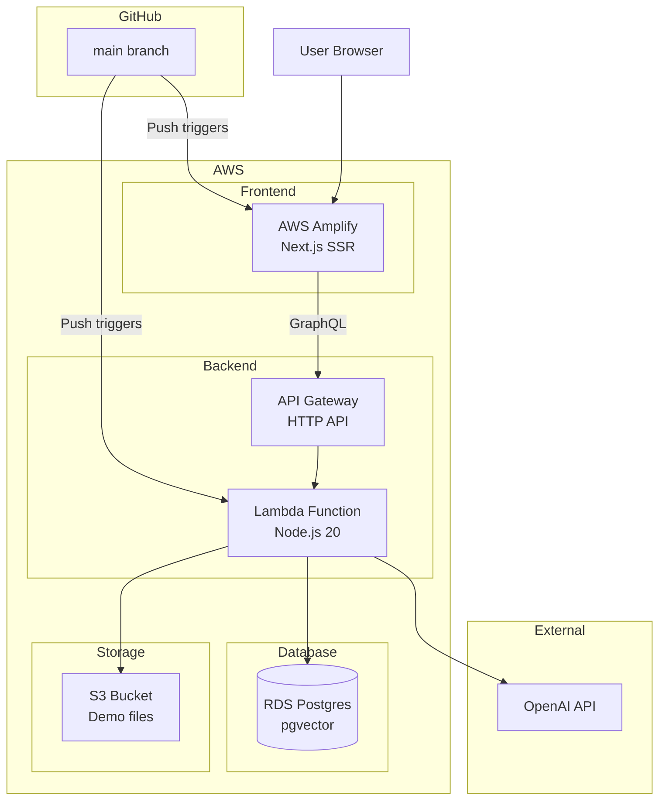

# Milestone 6 — Demo Ready

## Goal

A polished, deployed, and stable application ready to show in interviews, share as a portfolio link, and demonstrate AI engineering competence. Everything works end-to-end from a public URL with sample data pre-loaded for instant demos.

## Done When

* [ ] Application deployed and accessible from a public URL
* [ ] Frontend on AWS (Amplify or CloudFront + S3)
* [ ] Backend on AWS (Lambda + API Gateway)
* [ ] Database on AWS RDS Postgres with pgvector enabled
* [ ] Infrastructure defined as code (CDK or SST — TypeScript)
* [ ] CI/CD pipeline: push to `main` → auto-deploy
* [ ] Health check endpoint returns 200 from production URL
* [ ] Sample documents pre-loaded for instant demo
* [ ] README has a GIF/video demo and one-command local setup
* [ ] Error states handled gracefully — no blank screens or unhandled exceptions
* [ ] Cold start latency acceptable (< 5 seconds for Lambda)
* [ ] No secrets exposed in client-side code or Git history
* [ ] Demo script written — can walk through the app in 3 minutes
* [ ] GitHub repo is public with clean commit history

## Out of Scope

* No authentication (single-user app)
* No custom domain (use default AWS URLs)
* No dark mode
* No analytics or tracking
* No rate limiting (single-user, demo only)

## Deployment Architecture



## New Files

```
miniglean/
├── infra/                             ← NEW (Infrastructure as Code)
│   ├── sst.config.ts                  ← SST project config
│   ├── stacks/
│   │   ├── database.ts                ← RDS Postgres + pgvector
│   │   ├── api.ts                     ← Lambda + API Gateway
│   │   ├── frontend.ts                ← Amplify / CloudFront
│   │   └── secrets.ts                 ← SSM parameters for env vars
│   └── package.json
├── demo/                              ← NEW (Demo assets)
│   ├── documents/
│   │   ├── rental-contract.pdf        ← Sample document 1
│   │   ├── fastapi-notes.pdf          ← Sample document 2
│   │   └── meeting-notes.txt          ← Sample document 3
│   ├── seed.ts                        ← Script to ingest demo docs
│   └── demo-script.md                 ← Interview walkthrough script
├── .github/
│   └── workflows/
│       ├── deploy.yml                 ← CD pipeline
│       └── test.yml                   ← CI pipeline
├── README.md                          ← UPDATE (full rewrite)
├── CONTRIBUTING.md                    ← NEW
└── docs/
    └── deployment.md                  ← UPDATE (AWS-specific)
```

## Tasks

### 1. Set up infrastructure as code

`infra/stacks/database.ts`:

* RDS Postgres 16 (`db.t4g.micro` — free tier eligible)
* pgvector extension enabled via custom parameter group
* Private subnet — not publicly accessible
* Security group allows inbound from Lambda only
* Automated backups enabled (7-day retention)
* Database name: `miniglean`

`infra/stacks/api.ts`:

* Lambda function (Node.js 20 runtime)
* Memory: 512MB (enough for embedding payloads)
* Timeout: 30 seconds (enough for OpenAI calls)
* API Gateway HTTP API (not REST API — cheaper, faster)
* Environment variables from SSM Parameter Store
* VPC configuration to reach RDS
* CORS configured for frontend domain

`infra/stacks/frontend.ts`:

* AWS Amplify connected to GitHub repo
* Root directory: `apps/web`
* Build settings: `npm run build`
* Environment variable: `NEXT_PUBLIC_API_URL` pointing to API Gateway

`infra/stacks/secrets.ts`:

* SSM Parameter Store (SecureString):
  * `/miniglean/openai-api-key`
  * `/miniglean/database-url`
* Lambda reads these at cold start

### 2. Set up CI/CD pipelines

`.github/workflows/test.yml`

Triggers: Push to any branch, PRs to `main`

```yaml
Steps:
  - Checkout
  - Install Node.js 20
  - Install dependencies (apps/api + apps/web)
  - Lint backend: eslint
  - Lint frontend: eslint
  - Run backend unit tests: vitest
  - Run frontend tests: vitest
  - Type check: tsc --noEmit
```

Rules:
* Must pass before merge to `main`
* Runs in < 3 minutes
* No real API calls — all mocked

`.github/workflows/deploy.yml`

Triggers: Push to `main` only

```yaml
Steps:
  - Checkout
  - Configure AWS credentials (OIDC or access keys)
  - Install dependencies
  - Run tests (gate — fail fast)
  - Deploy infrastructure: sst deploy --stage prod
  - Run database migration: npx drizzle-kit push
  - Smoke test: curl health endpoint
  - Notify on failure (optional — GitHub Actions summary)
```

### 3. Optimize Lambda cold starts

Mitigations:

| Technique | Impact |
|---|---|
| Bundle with esbuild (SST does this) | Smaller package = faster load |
| Lazy-load heavy deps (OpenAI SDK) | Only import when needed |
| Keep Lambda warm (CloudWatch rule every 5 min) | Prevents cold start in demos |
| Use provisioned concurrency (if budget allows) | Guarantees warm instance |
| Connection pooling for RDS | Avoid reconnecting on every request |

Lambda warmer — CloudWatch Events rule that pings the health endpoint every 5 minutes:
* Keeps one Lambda instance warm
* Costs nothing (within free tier invocations)
* Ensures demo never hits a cold start

### 4. Create demo documents

`demo/documents/rental-contract.pdf` — a 2-page mock rental contract with:
* Tenant and landlord details
* Monthly rent amount
* Bond amount
* Termination conditions (30-day notice)
* Maintenance responsibilities
* Purpose: Tests factual Q&A — "What are the termination conditions?"

`demo/documents/fastapi-notes.pdf` — a 3-page study notes document covering:
* What FastAPI is
* Route decorators
* Dependency injection
* Pydantic models
* Async endpoints
* Purpose: Tests summarization — "Summarize my FastAPI notes"

`demo/documents/meeting-notes.txt` — plain text meeting notes:
* Date, attendees
* Action items
* Decisions made
* Follow-up deadlines
* Purpose: Tests note ingestion and search — "What action items were assigned?"

### 5. Create seed script

`demo/seed.ts`:

```typescript
// Run with: npx tsx demo/seed.ts

async function seed() {
  console.log('Seeding demo documents...');

  // 1. Upload rental contract PDF
  await uploadPdf('./demo/documents/rental-contract.pdf');
  console.log('✓ rental-contract.pdf');

  // 2. Upload FastAPI notes PDF
  await uploadPdf('./demo/documents/fastapi-notes.pdf');
  console.log('✓ fastapi-notes.pdf');

  // 3. Add meeting notes as text
  const notes = fs.readFileSync('./demo/documents/meeting-notes.txt', 'utf-8');
  await addNote(notes, ['meeting', 'action-items']);
  console.log('✓ meeting-notes.txt');

  console.log('Done! 3 documents seeded.');
}
```

Usage:

```bash
# Local
NEXT_PUBLIC_API_URL=http://localhost:8000 npx tsx demo/seed.ts

# Production
NEXT_PUBLIC_API_URL=https://your-api.execute-api.ap-southeast-2.amazonaws.com npx tsx demo/seed.ts
```

### 6. Write the demo script

`demo/demo-script.md`:

```markdown
# MiniGlean Demo Script (3 minutes)

## Setup (before demo)
- Open the app in browser
- Ensure 3 demo documents are loaded
- Open the document library tab

## Flow

### 1. Show the library (30 seconds)
- "This is my personal knowledge base. I've uploaded a rental contract,
   some study notes, and meeting notes."
- Point out: type badges, chunk counts, dates

### 2. Ask a factual question (45 seconds)
- Navigate to /chat
- Type: "What are the termination conditions in my rental contract?"
- Show: streaming response appearing in real-time
- Show: source citation chip → click to expand excerpt
- "The agent searched my knowledge base and answered with a citation."

### 3. Summarize a document (30 seconds)
- Type: "Summarize my FastAPI notes"
- Show: agent picks the summarize tool (different from search)
- "It recognized I wanted a summary, not a search — and picked the right tool."

### 4. Compare two documents (30 seconds)
- Type: "Compare my rental contract and meeting notes"
- Show: structured comparison with both sources cited
- "It pulls from both documents and gives me a structured comparison."

### 5. Save a note (15 seconds)
- Type: "Remember that the next meeting is Tuesday at 2pm"
- Show: confirmation that note was saved
- "I can also save information into the knowledge base conversationally."

### 6. Architecture callout (30 seconds)
- "Under the hood: TypeScript everywhere, GraphQL API, custom AI agent
   with MCP tools, pgvector for semantic search, deployed on AWS with
   infrastructure as code."
- "The agent decides which tool to use based on intent — it's not
   hardcoded routing."

## Key Points to Mention
- Custom agent (not a LangChain wrapper)
- MCP-compatible tool definitions
- Streaming responses (SSE)
- Source citations for traceability
- AWS deployment (Lambda + RDS + Amplify)
- TypeScript full-stack
```

### 7. Rewrite the README

`README.md` structure:

```markdown
# MiniGlean

> Personal AI knowledge search assistant. Upload documents, paste URLs,
> write notes — then chat with your entire knowledge base.

[GIF demo here — 15 seconds showing upload → ask → get cited answer]

## Features
- 📄 Upload PDFs, URLs, and notes
- 🔍 Semantic search across all your documents
- 🤖 AI agent that summarizes, compares, and answers questions
- 📎 Source citations on every answer
- ⚡ Streaming responses in real-time

## Tech Stack
| Layer | Tech |
|---|---|
| Frontend | Next.js 14 + React + Tailwind (MD3) |
| Backend | Node.js + Apollo GraphQL + Custom AI Agent |
| Database | Postgres + pgvector (semantic search) |
| AI | OpenAI gpt-4o + text-embedding-3-small |
| Infrastructure | AWS (Lambda + RDS + Amplify) + SST |
| Agent Protocol | MCP (Model Context Protocol) |

## Quick Start

### Prerequisites
- Node.js 20+
- Docker (for local Postgres)
- OpenAI API key

### Run locally
git clone https://github.com/yourname/miniglean.git
cd miniglean
cp apps/api/.env.example apps/api/.env
# Add your OPENAI_API_KEY to apps/api/.env
docker-compose up    # Starts Postgres + API + Frontend
# Open http://localhost:3000

### Seed demo data
npx tsx demo/seed.ts

## Architecture
[Link to docs/architecture.md]

## Documentation
- Architecture: docs/architecture.md
- Database: docs/database.md
- Deployment: docs/deployment.md
- Integration Tests: docs/integration-test.md

## License
MIT
```

### 8. Record a demo GIF

Tool: Use [screen.studio](https://screen.studio/), [Kap](https://getkap.co/), or ffmpeg

What to record (15 seconds):
* Show the document library (2 seconds)
* Navigate to chat (1 second)
* Type a question (3 seconds)
* Show streaming response (5 seconds)
* Click a source citation chip (2 seconds)
* Expand to show excerpt (2 seconds)

Specs:
* Width: 800px (looks good in GitHub README)
* Format: GIF or MP4 (GIF for README, MP4 for LinkedIn)
* Duration: 15–20 seconds max
* No audio needed

### 9. Error handling hardening

| Scenario | Expected Behaviour |
|---|---|
| Backend is down | Frontend shows "Cannot reach server" error banner with retry |
| OpenAI rate limited | Backend returns 429, frontend shows "AI service busy, try again" |
| Upload fails mid-stream | Upload panel shows error, file input resets |
| Chat stream disconnects | Partial message shown, error below, retry button |
| Invalid PDF (corrupted) | "Unable to parse this PDF" error in upload panel |
| Document limit reached (20) | "Knowledge base full. Delete a document to upload more." |
| Empty knowledge base + chat | "I don't have that in my knowledge base." — no crash |
| Very long question (> 2000 chars) | Validation error shown before sending |
| Network offline | All actions show "No internet connection" |

### 10. Performance checklist

| Metric | Target | How to Verify |
|---|---|---|
| Frontend load (first paint) | < 2 seconds | Lighthouse |
| Chat response start (first token) | < 3 seconds | Manual timing |
| Document upload (1-page PDF) | < 5 seconds | Manual timing |
| Health check latency | < 500ms (warm) | `curl -w "%{time_total}"` |
| Lambda cold start | < 5 seconds | First request after 15 min idle |
| Bundle size (frontend) | < 500KB gzipped | `next build` output |

### 11. Security checklist

* [ ] No secrets in Git history — `git log --all -p | grep -i "api_key"`
* [ ] `.env` in `.gitignore` — confirmed
* [ ] `OPENAI_API_KEY` in SSM (not Lambda env) — configured
* [ ] CORS restricted to frontend domain only — confirmed
* [ ] No `eval()` or `dangerouslySetInnerHTML` — grep codebase
* [ ] API Gateway throttling enabled — default 10,000 req/s is fine
* [ ] RDS not publicly accessible — security group only allows Lambda
* [ ] No debug/verbose logging in production — `LOG_LEVEL=INFO`

### 12. Create CONTRIBUTING.md

```markdown
# Contributing

## Local Development

docker-compose up

## Project Structure
See CLAUDE.md for full context.

## Branch Naming
feat/short-description
fix/short-description
chore/short-description

## Commit Messages
type(scope): description

## Before Pushing
- [ ] npm run lint passes (both apps)
- [ ] npm test passes (both apps)
- [ ] No any types
- [ ] No secrets in code
```

### 13. Clean up Git history

Before making the repo public:

* [ ] Squash any "WIP" or "fix typo" commits
* [ ] Ensure no secrets ever appeared in history (use `git filter-branch` or BFG if needed)
* [ ] Write meaningful commit messages for major milestones
* [ ] Tag releases: `v0.1.0` (setup), `v0.2.0` (ingestion), etc.

Ideal commit history:

```
feat(infra): deploy to AWS with SST
feat(ui): add chat page with streaming responses
feat(ui): add document library and upload panel
feat(agent): add LangChain agent with 4 tools
feat(rag): add semantic search with pgvector
feat(ingestion): add PDF, URL, and note ingestion
feat(setup): scaffold monorepo with Next.js + Node.js + Postgres
docs: add architecture, database, and deployment docs
chore: initial commit with CLAUDE.md and project structure
```

## Final Verification

### Local Smoke Test

```bash
# Start fresh
docker-compose down -v
docker-compose up

# Run migrations
docker-compose exec api npx drizzle-kit push

# Seed demo data
npx tsx demo/seed.ts

# Verify
curl http://localhost:8000/health
open http://localhost:3000

# Full flow
# 1. Documents appear in library
# 2. Ask a question → get streaming answer with sources
# 3. Summarize → works
# 4. Compare → works
# 5. Add note → appears in library
# 6. Delete document → disappears
```

### Production Smoke Test

```bash
# After deploy
curl https://your-api.execute-api.ap-southeast-2.amazonaws.com/health
# → { "status": "ok", "database": "connected" }

open https://your-app.amplifyapp.com
# Full flow same as local

# Verify cold start
# Wait 15 minutes → first request should complete in < 5 seconds
```

### Interview Ready Checklist

* [ ] App loads from public URL without errors
* [ ] 3 demo documents pre-loaded
* [ ] Can complete full demo script in 3 minutes
* [ ] Can explain architecture when asked
* [ ] Can explain agent tool selection when asked
* [ ] Can explain MCP when asked
* [ ] Can explain RAG pipeline when asked
* [ ] README looks professional with GIF demo
* [ ] Code is clean — no TODO comments, no dead code
* [ ] GitHub repo is public

## Cost Estimate (Production)

| Service | Monthly Cost (Free Tier) | After Free Tier |
|---|---|---|
| AWS Amplify | Free (1000 build min/month) | ~$5 |
| Lambda | Free (1M requests/month) | ~$0 at demo scale |
| API Gateway | Free (1M requests/month) | ~$0 at demo scale |
| RDS (`db.t4g.micro`) | Free (12 months) | ~$15/month after |
| OpenAI | ~$1–5 (pay per query) | Same |
| **Total** | **~$1–5/month** | **~$20/month** |

## What Success Looks Like

After this milestone:

* You share a link — interviewer opens it, sees a polished app
* They try it — upload works, chat works, citations appear
* They ask "how does it work?" — you walk through the architecture
* They ask "how did you build it?" — you show the clean codebase
* They ask "can you do this for us?" — you say "this is exactly what I do"

The app demonstrates:

* TypeScript full-stack proficiency
* AI agent architecture (custom, not just API wrappers)
* MCP tool protocol knowledge
* AWS infrastructure skills
* Clean code and system design
* End-to-end delivery capability

## What's Next (Post-Portfolio Stretch Goals)

These are NOT required — only if you want to keep building:

| Feature | Why |
|---|---|
| Dev workflow agent | Add `read_file`, `write_file`, `run_tests` tools → directly aligns with JD |
| Multi-user auth | Cognito + row-level security |
| Dark mode | Full MD3 dark theme |
| Document preview | Inline PDF viewer |
| Usage dashboard | Show token costs, query history |
| Webhook triggers | Slack integration for notifications |
